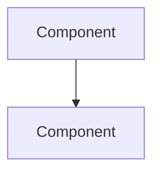

<!-- Radio Calico Skill v1.0.0 -->
Generate system architecture diagrams in Mermaid format for Radio Calico.

### Diagrams to generate

Create/update the file `docs/architecture.md` with the following Mermaid diagrams:

1. **System Architecture** — High-level overview showing all components:
   - Client browser (HLS.js, player.js, CSS)
   - CDN (CloudFront: HLS stream + metadata JSON)
   - nginx reverse proxy (static files + /api proxy)
   - gunicorn (Flask API)
   - MySQL database
   - External APIs (iTunes Search, Google Fonts)

2. **Request Flow** — Sequence diagram showing:
   - Static file request: Client → nginx → static files
   - API request: Client → nginx → gunicorn → MySQL → response
   - Streaming: Client → CloudFront → HLS segments
   - Metadata: Client → CloudFront JSON → iTunes API (artwork)

3. **CI/CD Pipeline** — Flowchart of GitHub Actions jobs:
   - lint → [python-tests, integration-tests, js-tests, skills-tests] → [e2e-tests, zap]
   - Parallel security jobs: bandit, safety, npm-audit, hadolint, trivy

4. **Database Schema** — ER diagram showing:
   - ratings (id, station, score, ip, created_at)
   - users (id, username, password_hash, salt, token, created_at)
   - profiles (id, user_id FK, nickname, email, genres, about)
   - feedback (id, email, message, ip, username, nickname, genres, about, created_at)

5. **Authentication Flow** — Sequence diagram:
   - Register → Login → Token → Profile/Feedback → Logout

### Steps

1. **Read current codebase** to ensure diagrams reflect actual state:
   - `api/app.py` for endpoints and auth flow
   - `nginx/nginx.conf` for proxy config
   - `docker-compose.yml` for service topology
   - `.github/workflows/ci.yml` for CI pipeline
   - `db/init.sql` for schema

2. **Generate** all 5 diagrams in `docs/architecture.md` using Mermaid syntax

3. **Validate** the Mermaid syntax is correct (no broken references)

4. **Report** which diagrams were created/updated

### Output format

Each diagram should be in a fenced code block with `mermaid` language tag:

The file should have a table of contents linking to each diagram section.