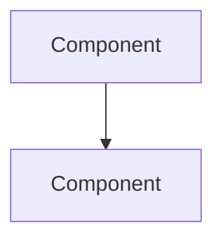

<!-- Radio Calico Skill v2.0.0 -->
Generate system architecture diagrams in Mermaid format for Radio Calico.

## Agent
Delegate this entire skill to the **Documentation Writer** subagent (`documentation-writer`).
The Documentation Writer has specialized knowledge of cross-document consistency, Mermaid diagrams, and all docs generation workflows. It will run all steps in an isolated context window and return only a summary to the main conversation.

### Document header

Start `docs/architecture.md` with this exact header block (logo right, version table left, vertically centered):

```html
<table><tr>
<td valign="middle">

# Radio Calico - Architecture Diagrams

| Field | Value |
| --- | --- |
| **Project** | Radio Calico |
| **Version** | 1.0.0 |
| **Date** | YYYY-MM-DD |
| **Status** | Living document |

</td>
<td valign="middle" width="20%" align="right"></td>
</tr></table>

---

## Table of Contents

1. [System Architecture](#1-system-architecture)
2. [Request Flow](#2-request-flow)
...

---
```

### Diagrams to generate

Create/update the file `docs/architecture.md` with the following Mermaid diagrams:

1. **System Architecture** — High-level overview (graph TD) showing all components:
   - Client browser (HLS.js, player.js, CSS)
   - CDN (CloudFront: HLS stream + metadata JSON)
   - nginx reverse proxy (static files + /api proxy)
   - gunicorn (Flask API)
   - MySQL database
   - External APIs (iTunes Search, Google Fonts)

2. **Request Flow** — Sequence diagram showing:
   - Static file request: Client → nginx → static files
   - API request: Client → nginx → gunicorn → MySQL → response
   - Streaming: Client → CloudFront → HLS segments
   - Metadata: Client → CloudFront JSON → iTunes API (artwork)

3. **Data Flow — Playback & Metadata** — Flowchart (graph TD) showing:
   - Page load → fetchMetadata() → CloudFront JSON
   - FRAG_CHANGED event → triggerMetadataFetch() → debounce (3s)
   - Metadata response → latency delay → updateTrack()
   - updateTrack() → fetchArtwork() → fetchItunesCached() → localStorage (24h TTL)
   - updateTrack() → updateRatingUI() → checkIfRated() + fetchTrackRatings()
   - updateTrack() → pushHistory() → renderHistory()
   - History merging: fresh tracks from CloudFront + accumulated older entries

4. **Data Flow — User Interactions** — Flowchart (graph TD) showing:
   - Rating: click thumbs → submitRating() → POST /api/ratings → fetchTrackRatings()
   - Share: click share → getShareText()/getRecentlyPlayedText() → window.open()
   - Auth: register/login form → POST /api/register or /api/login → token → localStorage
   - Profile: form submit → PUT /api/profile → confirmation
   - Feedback: form submit → POST /api/feedback (with profile snapshot)
   - Theme: radio button → applyTheme() → data-theme attribute + localStorage
   - Quality: radio button → applyStreamQuality() → initHls() + localStorage

5. **Event-Driven Architecture** — Flowchart (graph LR) showing:
   - HLS.js events: MANIFEST_PARSED → enable play + set quality level
   - HLS.js events: FRAG_CHANGED → triggerMetadataFetch()
   - HLS.js events: FRAG_PARSING_METADATA → parseID3Frames() → handleMetadataFields()
   - HLS.js events: LEVEL_LOADED → update source quality display
   - HLS.js events: ERROR (fatal) → exponential backoff retry (max 10)
   - Audio events: playing → showPlayIcon('pause')
   - Audio events: waiting → showPlayIcon('spinner')
   - Audio events: timeupdate → update elapsed/total time display
   - DOM events: click handlers for play, mute, rate, share, filter, settings, drawer

6. **CI/CD Pipeline** — Flowchart (graph LR) of GitHub Actions jobs:
   - lint → [python-tests, integration-tests, js-tests, skills-tests] → [e2e-tests, zap]
   - Parallel security jobs: bandit, safety, npm-audit, hadolint, trivy

7. **Database Schema** — ER diagram showing:
   - ratings (id, station, score, ip, created_at)
   - users (id, username, password_hash, salt, token, created_at)
   - profiles (id, user_id FK, nickname, email, genres, about)
   - feedback (id, email, message, ip, username, nickname, genres, about, created_at)

8. **Authentication Flow** — Sequence diagram:
   - Register → Login → Token → Profile/Feedback → Logout

### Steps

1. **Read current codebase** to ensure diagrams reflect actual state:
   - `api/app.py` for endpoints and auth flow
   - `static/js/player.js` for event handlers, data flow, and state management
   - `nginx/nginx.conf` for proxy config
   - `docker-compose.yml` for service topology
   - `.github/workflows/ci.yml` for CI pipeline
   - `db/init.sql` for schema

2. **Generate** all 8 diagrams in `docs/architecture.md` using Mermaid syntax

3. **Validate** the Mermaid syntax is correct (no broken references)

4. **Report** which diagrams were created/updated

### Output format

Each diagram should be in a fenced code block with `mermaid` language tag:



The file should have a table of contents linking to each diagram section.