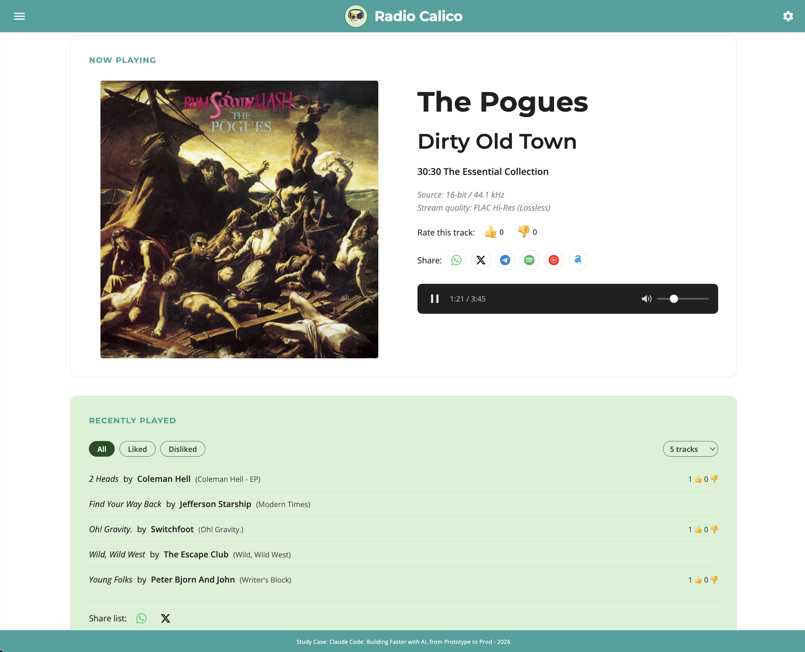

<p align="center">
  
</p>

<h1 align="center">Radio Calico</h1>

<p align="center">
  <strong>A live audio streaming web player</strong><br>
  Ad-free, subscription-free — 48 kHz FLAC lossless or AAC Hi-Fi 211 kbps via HLS
</p>

<p align="center">
  <em>Study Case: Claude Code — Building Faster with AI, from Prototype to Prod (2026)</em>
</p>

---

## What is Radio Calico?

Radio Calico is a web-based live audio streaming player that delivers audio via HLS from AWS CloudFront (48kHz FLAC lossless or AAC Hi-Fi 211 kbps, user-selectable). It features real-time track metadata, album artwork from iTunes, user ratings, account management with profiles, social sharing, and a feedback system — all built with vanilla JavaScript (no frameworks) and a Python Flask backend.

### Key Features

- **Adaptive Streaming** — 48 kHz FLAC lossless or AAC Hi-Fi 211 kbps, user-selectable via settings (CloudFront CDN)
- **Real-time Metadata** — artist, title, album, artwork update as songs change
- **Track Ratings** — thumbs up/down with IP-based deduplication
- **User Accounts** — register, login, profile with music genre preferences
- **Recently Played** — history with filters (All/Liked/Disliked), configurable limit (5–20 tracks)
- **Social Sharing** — share current track or recently played list via WhatsApp, X/Twitter, Telegram
- **Music Search** — find tracks on Spotify, YouTube Music, Amazon Music
- **Feedback System** — logged-in users can submit feedback (stored with profile data)
- **Dark/Light Theme** — toggle via settings gear, persisted in localStorage
- **Responsive Design** — single-column layout below 700px

---

## Screenshots

### Light Mode

<p align="center">
  
</p>

*Light theme — Now Playing with album artwork, metadata, ratings, share buttons (WhatsApp, X, Telegram, Spotify, YouTube Music, Amazon), player bar, Recently Played with filters, and sticky footer.*

### Settings / Configurations

<p align="center">
  
</p>

*Settings dropdown — Light/Dark theme toggle and Stream Quality selection (FLAC Hi-Res lossless or AAC Hi-Fi).*

### Dark Mode (Default)

<p align="center">
  
</p>

*Dark theme — all colors adapt via CSS custom property overrides. Default theme on first visit.*

### Login / Register

<p align="center">
  
</p>

*Hamburger menu opens a slide-out drawer with Login/Register form.*

### User Profile

<p align="center">
  
</p>

*Logged-in view — profile with nickname, email, music genre preferences (tag-style checkboxes), and "About You" text area.*

### Feedback

<p align="center">
  
</p>

*Feedback form — submit via email (stored in DB), or post on X/Twitter or Telegram.*

---

## Architecture

```text
┌────────────────────────────────────────────────────────────────────────┐
│                          CONTENT LAYER                                 │
│                                                                        │
│   ┌───────────────┐     ┌──────────────────┐     ┌──────────────────┐  │
│   │ Audio Source  │────>│ HLS Encoder      │────>│ AWS CloudFront   │  │
│   │ (Radio Feed)  │     │ (+ metadata)     │     │ CDN              │  │
│   └───────────────┘     └──────────────────┘     └────────┬─────────┘  │
│                                                           │            │
│                                                  ┌───────────────┐     │
│                                                  │metadatav2.json│     │
│                                                  └────────┬──────┘     │
└───────────────────────────────────────────────────────────┼────────────┘
                                                            │
                           HTTPS (HLS + JSON metadata)      │
                                                            │
┌───────────────────────────────────────────────────────────┼────────────┐
│                      PRESENTATION LAYER                   │            │
│                                                           v            │
│   ┌──────────────────────────────────────────────────────────────┐     │
│   │                    Web Browser                               │     │
│   │  ┌─────────────┐  ┌─────────────┐  ┌─────────────────────┐   │     │
│   │  │ HLS.js      │  │ player.js   │  │ index.html +        │   │     │
│   │  │ (streaming) │─>│ (logic)     │─>│ player.css (UI)     │   │     │
│   │  └─────────────┘  └──────┬──────┘  └─────────────────────┘   │     │
│   │                          │                                   │     │
│   │              artwork     │    ratings / auth / profile       │     │
│   │              query       │    feedback                       │     │
│   │                v         v                                   │     │
│   │         ┌────────────┐  ┌──────────────────┐                 │     │
│   │         │ iTunes API │  │ Flask API :5000  │                 │     │
│   │         │ (artwork)  │  │ /api/*           │                 │     │
│   │         └────────────┘  └────────┬─────────┘                 │     │
│   └──────────────────────────────────┼───────────────────────────┘     │
└──────────────────────────────────────┼────────────────────────────────-┘
                                       │
┌──────────────────────────────────────┼────────────────────────────────┐
│                        SERVICE LAYER │                                │
│                                      v                                │
│   ┌──────────────────────┐      ┌──────────────────────┐              │
│   │  Flask API           │      │  MySQL 5.7           │              │
│   │  (api/app.py)        │─────>│  ratings, users,     │              │
│   │  Port 5000           │      │  profiles, feedback  │              │
│   └──────────────────────┘      └──────────────────────┘              │
└───────────────────────────────────────────────────────────────────────┘
```

### Data Flow — Playback & Metadata

```text
Page Load ──> fetchMetadata() ──> CloudFront /metadatav2.json
                                        │
                                        v
                                 updateTrack(artist, title, album)
                                   │         │            │
                                   v         v            v
                             DOM updated  songStartTime  fetchArtwork()
                                          = Date.now()       │
                                                             v
                                                      iTunes Search API
                                                      (artwork + duration)

User clicks Play ──> HLS.js loads stream ──> audio plays
                          │
                          ├── FRAG_CHANGED ──> triggerMetadataFetch() (3s debounce)
                          │                         │
                          │                         v
                          │                  fetchMetadata() ──> delayed updateTrack()
                          │                  (waits hls.latency to sync audio/UI)
                          │
                          └── audio decoded ──> speakers
```

### Data Flow — Authentication & Profile

```text
Register ──> POST /api/register { username, password }
                  │
                  v
            Hash password (PBKDF2 (260k iterations) + random salt with timing-safe comparison)
            Store in users table
            201 Created

Login ──> POST /api/login { username, password }
               │
               v
         Verify password against stored hash
         Generate token (secrets.token_hex)
         Store token in users table
         Return { token, username }
               │
               v
         Frontend stores in localStorage (rc-token, rc-user)

Profile ──> GET/PUT /api/profile (Authorization: Bearer <token>)
                 │
                 v
          Read/write profiles table (nickname, email, genres, about)

Feedback ──> POST /api/feedback (Authorization: Bearer <token>)
                  │
                  v
           Store message + full profile snapshot in feedback table
```

---

## API Endpoints

| Method | Endpoint | Auth | Description |
| ------ | -------- | ---- | ----------- |
| `GET` | `/api/ratings` | No | All ratings (IP addresses are not exposed) |
| `GET` | `/api/ratings/summary` | No | Likes/dislikes grouped by station |
| `GET` | `/api/ratings/check?station=...` | No | Check if current IP already rated |
| `POST` | `/api/ratings` | No | Submit rating `{ station, score }` (score must be 0 or 1) |
| `POST` | `/api/register` | No | Create account `{ username, password }` (rate limited: 5 req/min). Password: min 8, max 128 chars |
| `POST` | `/api/login` | No | Authenticate `{ username, password }` (rate limited: 5 req/min) |
| `GET` | `/api/profile` | Bearer | Get user profile |
| `PUT` | `/api/profile` | Bearer | Update profile `{ nickname, email, genres, about }` |
| `POST` | `/api/logout` | Bearer | Invalidate auth token |
| `POST` | `/api/feedback` | Bearer | Submit feedback `{ message }` |

---

## Getting Started

### Prerequisites

- **Python 3.9+** with `pip`
- **MySQL 5.7** (local via Homebrew: `brew install mysql@5.7`) — or use Docker (MySQL 8.0 included)
- A modern web browser (Chrome, Firefox, Safari, Edge)

### 1. Clone the repository

```bash
git clone https://github.com/mgmarques/radiocalico.git
cd radiocalico
```

### 2. Set up the Python virtual environment

```bash
cd api
python3 -m venv venv
source venv/bin/activate
pip install -r requirements.txt
```

For development (tests + security scanning):

```bash
pip install -r requirements-dev.txt
cd ..
npm install   # Install Jest for JavaScript tests
```

### 3. Configure environment variables

Copy the example file and edit with your credentials:

```bash
cp .env.example .env
```

Edit `api/.env`:

```env
DB_HOST=127.0.0.1
DB_USER=root
DB_PASSWORD=your_mysql_password
DB_NAME=radiocalico
FLASK_DEBUG=true
CORS_ORIGIN=*
```

#### Environment Variables Reference

| Variable | Description | Default | Required |
| -------- | ----------- | ------- | -------- |
| `DB_HOST` | MySQL server hostname | `127.0.0.1` | No |
| `DB_USER` | MySQL username | `root` | No |
| `DB_PASSWORD` | MySQL password | `""` (empty) | **Yes** |
| `DB_NAME` | MySQL database name | `radiocalico` | No |
| `FLASK_DEBUG` | Enable Flask debug mode | `false` | No |
| `CORS_ORIGIN` | Allowed CORS origin | `*` | No |

> **Important**: The `.env` file contains credentials and is excluded from git via `.gitignore`. Never commit it. The `.env.example` file is safe to commit and shows the required variables.

### 4. Set up MySQL

Start MySQL:

```bash
brew services start mysql@5.7
```

Create the database and tables:

```bash
mysql -u root -p -e "CREATE DATABASE IF NOT EXISTS radiocalico;"
mysql -u root -p radiocalico <<'SQL'
CREATE TABLE IF NOT EXISTS ratings (
  id INT AUTO_INCREMENT PRIMARY KEY,
  station VARCHAR(255) NOT NULL,
  score TINYINT NOT NULL,
  ip VARCHAR(45) NOT NULL,
  created_at TIMESTAMP DEFAULT CURRENT_TIMESTAMP,
  UNIQUE KEY unique_rating (station, ip)
);

CREATE TABLE IF NOT EXISTS users (
  id INT AUTO_INCREMENT PRIMARY KEY,
  username VARCHAR(50) NOT NULL UNIQUE,
  password_hash VARCHAR(64) NOT NULL,
  salt VARCHAR(32) NOT NULL,
  token VARCHAR(64) DEFAULT NULL,
  created_at TIMESTAMP DEFAULT CURRENT_TIMESTAMP
);

CREATE TABLE IF NOT EXISTS profiles (
  id INT AUTO_INCREMENT PRIMARY KEY,
  user_id INT NOT NULL UNIQUE,
  nickname VARCHAR(100) DEFAULT '',
  email VARCHAR(255) DEFAULT '',
  genres VARCHAR(500) DEFAULT '',
  about TEXT,
  updated_at TIMESTAMP DEFAULT CURRENT_TIMESTAMP ON UPDATE CURRENT_TIMESTAMP,
  FOREIGN KEY (user_id) REFERENCES users(id) ON DELETE CASCADE
);

CREATE TABLE IF NOT EXISTS feedback (
  id INT AUTO_INCREMENT PRIMARY KEY,
  email VARCHAR(255) DEFAULT '',
  message TEXT NOT NULL,
  ip VARCHAR(45) DEFAULT '',
  username VARCHAR(50) DEFAULT '',
  nickname VARCHAR(100) DEFAULT '',
  genres VARCHAR(500) DEFAULT '',
  about TEXT,
  created_at TIMESTAMP DEFAULT CURRENT_TIMESTAMP
);
SQL
```

### 5. Run the app

```bash
cd api
source venv/bin/activate
python app.py
```

Open **http://127.0.0.1:5000** in your browser. For Docker: open **http://127.0.0.1:5050** instead.

> **Note**: Flask serves both the frontend and API from port 5000. When running via Docker, the app is on port 5050 (configurable via `APP_PORT`). Debug mode defaults to off; set `FLASK_DEBUG=true` in your `.env` to enable it.

### Alternative: Docker Deployment

No local Python/MySQL/Node setup needed — everything runs in containers.

**Development** (Flask debug mode + hot reload on code changes):

```bash
make docker-dev
# or: docker compose --profile dev up --build
```

**Production** (nginx + gunicorn with 4 workers, detached):

```bash
make docker-prod
# or: docker compose --profile prod up --build -d
```

**Stop and clean up:**

```bash
make docker-down
```

**Run tests inside the container:**

```bash
make docker-test
```

| Command | Description |
|---------|-------------|
| `make docker-dev` | Start dev environment (Flask debug + hot reload) |
| `make docker-prod` | Start production (nginx + gunicorn, detached) |
| `make docker-down` | Stop all containers, remove volumes |
| `make docker-build` | Build images without starting |
| `make docker-test` | Run all tests inside the dev container |

**IMPORTANT**: Docker requires a `.env` file in the project root with real passwords. No defaults are provided — the containers will fail without it:

```bash
cp .env.example .env
# Edit .env — change MYSQL_ROOT_PASSWORD and DB_PASSWORD to secure values
```

The MySQL database is auto-initialized with the schema from `db/init.sql` on first startup.

---

## Testing & CI

### Run tests

```bash
make test          # Run all tests (Python + JavaScript)
make test-py       # Run Python unit tests only (61 tests)
make test-js       # Run JavaScript unit tests only (44 tests)
make coverage      # Python tests + coverage report (fails if <99%)
make security      # Bandit (SAST) + Safety (dependency scan)
make ci            # Full pipeline: Python coverage + JS tests + security
```

### Test results

**105 total tests** across both stacks:

| Stack | Tests | Tool | Coverage |
|-------|-------|------|----------|
| Python (backend) | 61 | pytest + pytest-cov | 99% (only `app.run()` uncovered) |
| JavaScript (frontend) | 44 | Jest + jsdom | All functions tested |

- **Python tests** use an isolated `radiocalico_test` database (auto-created/destroyed per test)
- **JavaScript tests** use jsdom for DOM simulation, with mocked `fetch`, `Hls.js`, `localStorage`, and `window.open`
- Tests cover: pure functions, DOM manipulation, API calls, ratings, auth, share text generation, history filtering, theme/quality switching, drawer navigation, ID3 parsing

### Security scanning

- **Bandit** — static analysis for Python security issues (0 issues found)
- **Safety** — checks dependencies for known vulnerabilities

---

## Project Structure

```text
radiocalico/
├── README.md                       # This file
├── CLAUDE.md                       # Claude Code AI assistant guidelines
├── Makefile                        # CI/CD automation targets (local + Docker)
├── Dockerfile                      # Multi-stage: dev (Flask) + prod (gunicorn)
├── docker-compose.yml              # Dev/prod profiles with MySQL + nginx
├── nginx/
│   └── nginx.conf                  # Reverse proxy: static files + /api (prod)
├── .dockerignore                   # Docker build exclusions
├── package.json                    # Node.js config (Jest for JS tests)
├── jest.config.js                  # Jest configuration
├── .gitignore                      # Git exclusions (.env, venv, node_modules, etc.)
├── design.md                       # Detailed architecture & design document
├── RadioCalico_Style_Guide.txt     # Brand colors, typography, component specs
├── RadioCalicoLayout.png           # UI layout reference screenshot
├── RadioCalicoLogoTM.png           # Logo with trademark
├── db/
│   └── init.sql                    # Database schema (auto-run by Docker MySQL)
├── api/
│   ├── app.py                      # Flask REST API (ratings, auth, profile, feedback)
│   ├── requirements.txt            # Production dependencies
│   ├── requirements-dev.txt        # Dev dependencies (pytest, bandit, safety)
│   ├── .env.example                # Environment variables template
│   ├── .env                        # Local credentials (git-ignored)
│   ├── conftest.py                 # Pytest fixtures
│   ├── test_app.py                 # 61 Python unit tests
│   ├── pytest.ini                  # Pytest configuration
│   ├── .bandit                     # Bandit security scan config
│   └── venv/                       # Python virtual environment (git-ignored)
├── static/
│   ├── index.html                  # Single-page app markup
│   ├── logo.png                    # Logo (navbar + favicon)
│   ├── css/
│   │   └── player.css              # Styles, design tokens, dark/light themes
│   └── js/
│       ├── player.js               # All client-side logic
│       └── player.test.js          # 44 JavaScript unit tests (Jest)
└── .claude/
    └── commands/                   # Claude Code slash commands
        ├── start.md                # /start — launch dev environment
        ├── check-stream.md         # /check-stream — verify stream status
        ├── troubleshoot.md         # /troubleshoot — diagnose issues
        ├── test-ratings.md         # /test-ratings — test ratings API
        ├── add-share-button.md     # /add-share-button — add share platform
        ├── add-dark-style.md       # /add-dark-style — dark mode for components
        ├── update-claude-md.md     # /update-claude-md — refresh docs
        └── run-ci.md              # /run-ci — full CI pipeline
```

---

## Technology Stack

| Layer | Technology | Purpose |
| ----- | ---------- | ------- |
| CDN | AWS CloudFront | Audio stream + metadata delivery |
| Streaming | HLS (M3U8 + TS) | Adaptive audio streaming (FLAC or AAC) |
| Frontend | Vanilla JS + HTML5 + CSS | Player UI (no framework, no build step) |
| Streaming Lib | HLS.js v1.x (CDN) | HLS decoding in non-Safari browsers |
| Metadata | CloudFront JSON | Track info (metadatav2.json) |
| Artwork | iTunes Search API | Album artwork + track duration |
| Fonts | Google Fonts | Montserrat (headings), Open Sans (body) |
| Backend | Python Flask | REST API for all endpoints |
| Database | MySQL 5.7 | Ratings, users, profiles, feedback |
| DB Driver | PyMySQL | Python-MySQL connector |
| Rate Limiting | flask-limiter | Request rate limiting for auth endpoints |
| Config | python-dotenv | Environment variable management |
| Python Testing | pytest + pytest-cov | 61 backend unit tests (99% coverage) |
| JS Testing | Jest + jsdom | 44 frontend unit tests |
| Security | Bandit + Safety | SAST + dependency vulnerability scanning |
| Containers | Docker + Docker Compose | Dev/prod deployment with MySQL |
| Reverse Proxy | nginx (alpine) | Static file serving + /api proxy (prod) |
| Prod Server | gunicorn | WSGI server (4 workers) behind nginx |

---

## Design Tokens

| Token | Light | Dark | Usage |
| ----- | ----- | ---- | ----- |
| `--mint` | `#D8F2D5` | `#1a3a1c` | Backgrounds, accents |
| `--forest` | `#1F4E23` | `#7ecf84` | Primary buttons, headings |
| `--teal` | `#38A29D` | `#245e5b` | Navbar, footer, hover states |
| `--orange` | `#EFA63C` | `#EFA63C` | Call-to-action |
| `--charcoal` | `#231F20` | `#e0e0e0` | Body text, player bar |
| `--cream` | `#F5EADA` | `#1a1a1a` | Secondary backgrounds |
| `--white` | `#FFFFFF` | `#121212` | Backgrounds |

---

## Troubleshooting

| Problem | Solution |
| ------- | -------- |
| Changes not showing | Hard refresh: `Cmd+Shift+R` |
| App on port 8080 | Kill old server: `lsof -i :8080`, use port 5000 |
| `/ratings/summary` 404 | Cached old JS — hard refresh |
| Metadata shows wrong song | Wait for HLS latency delay (~6s) |
| Register/Login fails | Check MySQL is running: `brew services list` |
| Emoji broken in shares | Expected — plain text `[N likes]` used instead |

---

## License

This project is a study case for demonstrating AI-assisted software development with [Claude Code](https://claude.ai/claude-code).

---

<p align="center">
  Built with <a href="https://claude.ai/claude-code">Claude Code</a> by Anthropic
</p>
