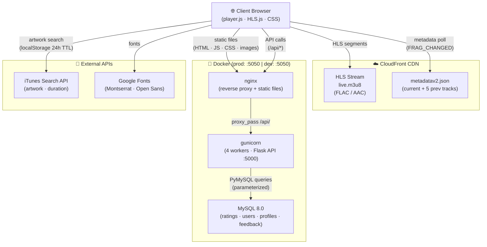
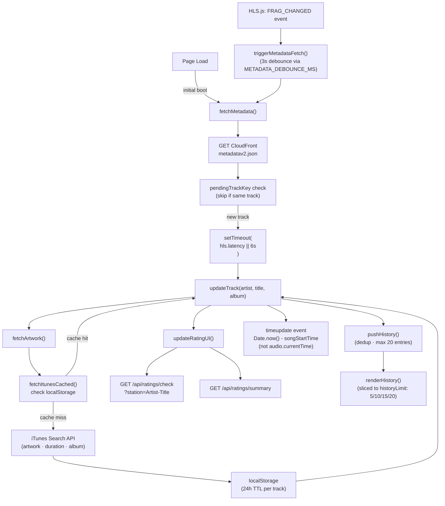
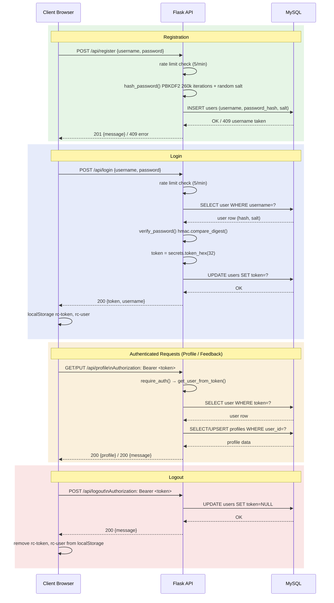
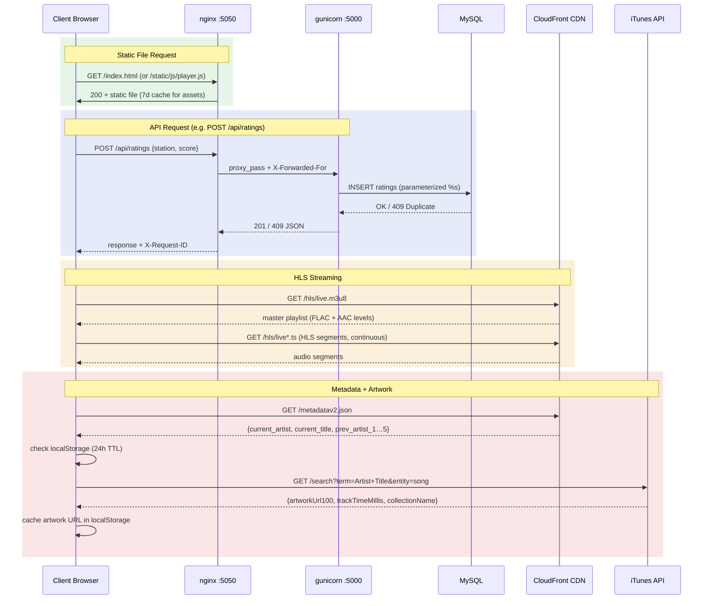
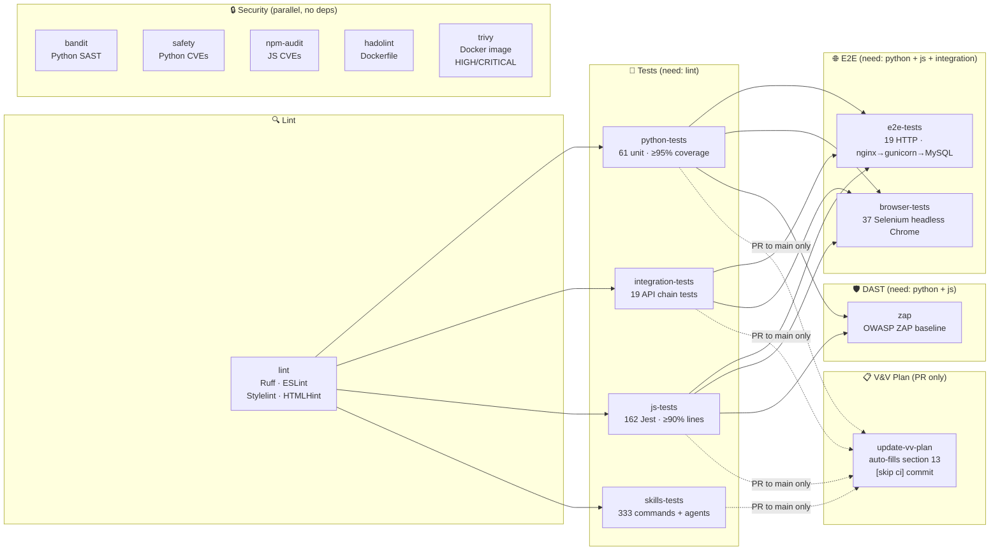
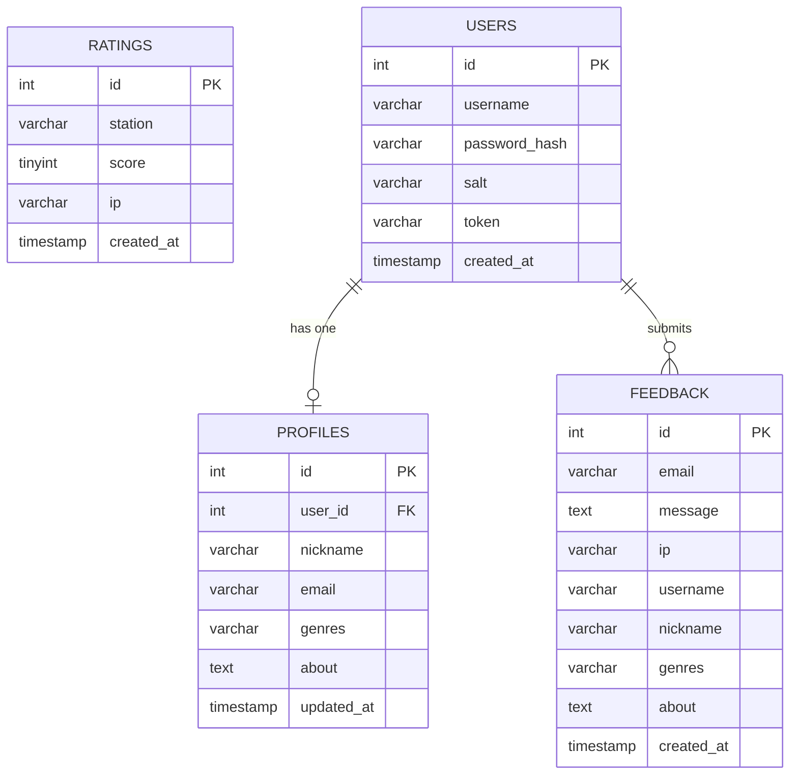
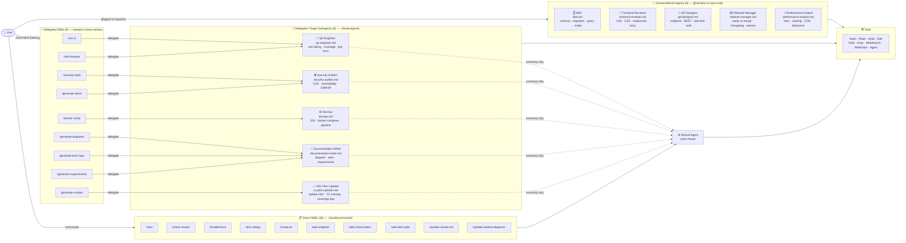

# Radio Calico

<table><tr>
<td valign="middle" width="20%"></td>
<td valign="middle">

**A live audio streaming web player**
Ad-free, subscription-free — 48 kHz FLAC lossless or AAC Hi-Fi 211 kbps via HLS

> Study Case: Claude Code — Building Faster with AI, from Prototype to Prod (2026)

</td>
</tr></table>

---

## What is Radio Calico?

Radio Calico is a web-based live audio streaming player that delivers audio via HLS from AWS CloudFront (48kHz FLAC lossless or AAC Hi-Fi 211 kbps, user-selectable). It features real-time track metadata, album artwork from iTunes, user ratings, account management with profiles, social sharing, and a feedback system — all built with vanilla JavaScript (no frameworks) and a Python Flask backend.

### Key Features

- **Adaptive Streaming** — 48 kHz FLAC lossless or AAC Hi-Fi 211 kbps, user-selectable via settings (CloudFront CDN)
- **Real-time Metadata** — artist, title, album, artwork update as songs change
- **Track Ratings** — thumbs up/down with IP-based deduplication
- **User Accounts** — register, login, profile with music genre preferences
- **Recently Played** — history with filters (All/Liked/Disliked), configurable limit (5–20 tracks)
- **Social Sharing** — share current track or recently played list via WhatsApp, X/Twitter, Telegram
- **Music Search** — find tracks on Spotify, YouTube Music, Amazon Music
- **Feedback System** — logged-in users can submit feedback (stored with profile data)
- **Dark/Light Theme** — toggle via settings gear, persisted in localStorage
- **Responsive Design** — single-column layout below 700px

---

## Screenshots

### Light Mode


*Light theme — Now Playing with album artwork, metadata, ratings, share buttons (WhatsApp, X, Telegram, Spotify, YouTube Music, Amazon), player bar, Recently Played with filters, and sticky footer.*

### Settings / Configurations


*Settings dropdown — Light/Dark theme toggle and Stream Quality selection (FLAC Hi-Res lossless or AAC Hi-Fi).*

### Dark Mode (Default)


*Dark theme — all colors adapt via CSS custom property overrides. Default theme on first visit.*

### Login / Register


*Hamburger menu opens a slide-out drawer with Login/Register form.*

### User Profile


*Logged-in view — profile with nickname, email, music genre preferences (tag-style checkboxes), and "About You" text area.*

### Feedback


*Feedback form — submit via email (stored in DB), or post on X/Twitter or Telegram.*

### Docker Production Stack


*Docker production deployment — nginx reverse proxy, gunicorn (4 workers), and MySQL 8.0 running as healthy containers.*

### CI/CD Pipeline (GitHub Actions)


*GitHub Actions workflow — 13 parallel jobs: lint, unit tests (Python + JS), integration tests, E2E tests, browser tests, skills validation, and 6 security scans (Bandit, Safety, npm audit, Hadolint, Trivy, OWASP ZAP).*

---

## Architecture

High-level overview of all components and how they connect in the Docker production stack.



### Data Flow — Playback & Metadata



### Data Flow — Authentication & Profile



---

## API Endpoints

| Method | Endpoint | Auth | Description |
| ------ | -------- | ---- | ----------- |
| `GET` | `/api/ratings` | No | All ratings (IP addresses are not exposed) |
| `GET` | `/api/ratings/summary` | No | Likes/dislikes grouped by station |
| `GET` | `/api/ratings/check?station=...` | No | Check if current IP already rated |
| `POST` | `/api/ratings` | No | Submit rating `{ station, score }` (score must be 0 or 1) |
| `POST` | `/api/register` | No | Create account `{ username, password }` (rate limited: 5 req/min). Password: min 8, max 128 chars |
| `POST` | `/api/login` | No | Authenticate `{ username, password }` (rate limited: 5 req/min) |
| `GET` | `/api/profile` | Bearer | Get user profile |
| `PUT` | `/api/profile` | Bearer | Update profile `{ nickname, email, genres, about }` |
| `POST` | `/api/logout` | Bearer | Invalidate auth token |
| `POST` | `/api/feedback` | Bearer | Submit feedback `{ message }` |

---

## Getting Started

### Prerequisites

- **Python 3.9+** with `pip`
- **MySQL 5.7** (local via Homebrew: `brew install mysql@5.7`) — or use Docker (MySQL 8.0 included)
- A modern web browser (Chrome, Firefox, Safari, Edge)

### 1. Clone the repository

```bash
git clone https://github.com/mgmarques/radiocalico.git
cd radiocalico
```

### 2. Set up the Python virtual environment

```bash
cd api
python3 -m venv venv
source venv/bin/activate
pip install -r requirements.txt
```

For development (tests + security scanning):

```bash
pip install -r requirements-dev.txt
cd ..
npm install   # Install Jest for JavaScript tests
```

### 3. Configure environment variables

Copy the example file and edit with your credentials:

```bash
cp .env.example .env
```

Edit `api/.env`:

```env
DB_HOST=127.0.0.1
DB_USER=root
DB_PASSWORD=your_mysql_password
DB_NAME=radiocalico
FLASK_DEBUG=true
CORS_ORIGIN=*
```

#### Environment Variables Reference

| Variable | Description | Default | Required |
| -------- | ----------- | ------- | -------- |
| `DB_HOST` | MySQL server hostname | `127.0.0.1` | No |
| `DB_USER` | MySQL username | `root` | No |
| `DB_PASSWORD` | MySQL password | `""` (empty) | **Yes** |
| `DB_NAME` | MySQL database name | `radiocalico` | No |
| `FLASK_DEBUG` | Enable Flask debug mode | `false` | No |
| `CORS_ORIGIN` | Allowed CORS origin | `*` | No |

> **Important**: The `.env` file contains credentials and is excluded from git via `.gitignore`. Never commit it. The `.env.example` file is safe to commit and shows the required variables.

### 4. Set up MySQL

Start MySQL:

```bash
brew services start mysql@5.7
```

Create the database and tables:

```bash
mysql -u root -p -e "CREATE DATABASE IF NOT EXISTS radiocalico;"
mysql -u root -p radiocalico <<'SQL'
CREATE TABLE IF NOT EXISTS ratings (
  id INT AUTO_INCREMENT PRIMARY KEY,
  station VARCHAR(255) NOT NULL,
  score TINYINT NOT NULL,
  ip VARCHAR(45) NOT NULL,
  created_at TIMESTAMP DEFAULT CURRENT_TIMESTAMP,
  UNIQUE KEY unique_rating (station, ip)
);

CREATE TABLE IF NOT EXISTS users (
  id INT AUTO_INCREMENT PRIMARY KEY,
  username VARCHAR(50) NOT NULL UNIQUE,
  password_hash VARCHAR(64) NOT NULL,
  salt VARCHAR(32) NOT NULL,
  token VARCHAR(64) DEFAULT NULL,
  created_at TIMESTAMP DEFAULT CURRENT_TIMESTAMP
);

CREATE TABLE IF NOT EXISTS profiles (
  id INT AUTO_INCREMENT PRIMARY KEY,
  user_id INT NOT NULL UNIQUE,
  nickname VARCHAR(100) DEFAULT '',
  email VARCHAR(255) DEFAULT '',
  genres VARCHAR(500) DEFAULT '',
  about TEXT,
  updated_at TIMESTAMP DEFAULT CURRENT_TIMESTAMP ON UPDATE CURRENT_TIMESTAMP,
  FOREIGN KEY (user_id) REFERENCES users(id) ON DELETE CASCADE
);

CREATE TABLE IF NOT EXISTS feedback (
  id INT AUTO_INCREMENT PRIMARY KEY,
  email VARCHAR(255) DEFAULT '',
  message TEXT NOT NULL,
  ip VARCHAR(45) DEFAULT '',
  username VARCHAR(50) DEFAULT '',
  nickname VARCHAR(100) DEFAULT '',
  genres VARCHAR(500) DEFAULT '',
  about TEXT,
  created_at TIMESTAMP DEFAULT CURRENT_TIMESTAMP
);
SQL
```

### 5. Run the app

```bash
cd api
source venv/bin/activate
python app.py
```

Open [http://127.0.0.1:5000](http://127.0.0.1:5000) in your browser. For Docker: open [http://127.0.0.1:5050](http://127.0.0.1:5050) instead.

> **Note**: Flask serves both the frontend and API from port 5000. When running via Docker, the app is on port 5050 (configurable via `APP_PORT`). Debug mode defaults to off; set `FLASK_DEBUG=true` in your `.env` to enable it.

### Alternative: Docker Deployment

No local Python/MySQL/Node setup needed — everything runs in containers.

**Development** (Flask debug mode + hot reload on code changes):

```bash
make docker-dev
# or: docker compose --profile dev up --build
```

**Production** (nginx + gunicorn with 4 workers, detached):

```bash
make docker-prod
# or: docker compose --profile prod up --build -d
```

**Stop and clean up:**

```bash
make docker-down
```

**Run tests inside the container:**

```bash
make docker-test
```

| Command | Description |
| --- | --- |
| `make docker-dev` | Start dev environment (Flask debug + hot reload) |
| `make docker-prod` | Start production (nginx + gunicorn, detached) |
| `make docker-down` | Stop all containers, remove volumes |
| `make docker-build` | Build images without starting |
| `make docker-test` | Run all tests inside the dev container |

**IMPORTANT**: Docker requires a `.env` file in the project root with real passwords. No defaults are provided — the containers will fail without it:

```bash
cp .env.example .env
# Edit .env — change MYSQL_ROOT_PASSWORD and DB_PASSWORD to secure values
```

The MySQL database is auto-initialized with the schema from `db/init.sql` on first startup.

### Request Flow

Sequence diagram showing the four main request types: static file serving, API calls through the nginx reverse proxy, HLS streaming from CloudFront, and artwork lookups from iTunes.



---

## Testing & CI

### Run tests

```bash
make test          # Run all tests (Python + JavaScript)
make test-py       # Run Python unit tests only (61 tests)
make test-js       # Run JavaScript unit tests only (162 tests)
make coverage      # Python tests + coverage report (fails if <95%)
make coverage-js   # JavaScript tests + coverage report (fails if <90% lines)
make security      # Bandit (SAST) + Safety (deps) + npm audit
make security-all  # All scans: security + hadolint + trivy + zap
make hadolint      # Dockerfile best practices linting
make trivy         # Docker image vulnerability scan
make zap           # OWASP ZAP dynamic security scan (requires running app)
make docker-security  # Docker-specific: hadolint + trivy
make ci            # Full pipeline: Python + JS coverage + security
```

### Test results

**670 total tests** across 7 suites:

| Suite | Tests | Tool | Coverage |
| --- | --- | --- | --- |
| Python unit | 61 | pytest + pytest-cov | 95% |
| Python integration | 19 | pytest | Multi-step API workflows |
| JavaScript unit | 162 | Jest + jsdom | 90% lines (threshold) |
| E2E (Docker) | 19 | pytest + requests | nginx → gunicorn → MySQL |
| Browser (Selenium) | 37 | Selenium + headless Chrome | UI, themes, auth, playback |
| Skills + Agents | 333 | pytest | 19 slash commands + 10 agents + 9 agent delegations |
| Script unit | 39 | pytest | SBOM enrichment, policy compliance, OSV cache, multi-project, DB persistence |

- **Python tests** use an isolated `radiocalico_test` database (auto-created/destroyed per test)
- **JavaScript tests** use jsdom for DOM simulation, with mocked `fetch`, `Hls.js`, `localStorage`, and `window.open`
- Tests cover: pure functions, DOM manipulation, API calls, ratings, auth, share text generation, history filtering, theme/quality switching, drawer navigation, ID3 parsing, HLS event handlers, metadata fetching, profile management, feedback, social sharing buttons

### CI/CD

All tests and security scans run automatically on every push and pull request via **GitHub Actions** (`.github/workflows/ci.yml`).

GitHub Actions workflow: lint runs first, then test jobs in parallel, with security scans running independently.



| Job | What it does |
| --- | --- |
| `python-tests` | pytest + coverage (95% threshold) with MySQL service |
| `js-tests` | Jest + coverage (90% lines threshold) |
| `browser-tests` | Selenium + headless Chrome against Docker prod stack |
| `bandit` | Python SAST |
| `safety` | Python dependency scan |
| `npm-audit` | JS dependency scan |
| `hadolint` | Dockerfile linting |
| `trivy` | Docker image vulnerability scan (HIGH+CRITICAL) |
| `zap` | OWASP ZAP DAST baseline scan against Docker prod stack |

### Security scanning

| Tool | Type | What it scans | Makefile target |
| --- | --- | --- | --- |
| **Bandit** | SAST | Python code (`app.py`) for security issues | `make bandit` |
| **Safety** | Dependency | Python `requirements.txt` for known CVEs | `make safety` |
| **npm audit** | Dependency | Node.js `package.json` for known CVEs | `make audit-npm` |
| **Hadolint** | Linting | `Dockerfile` for best practices | `make hadolint` |
| **Trivy** | Image scan | Docker image for OS/library vulnerabilities (HIGH+CRITICAL) | `make trivy` |
| **OWASP ZAP** | DAST | Running app for web vulnerabilities (baseline scan) | `make zap` |

Quick commands:

- `make security` — core scans (Bandit + Safety + npm audit)
- `make security-all` — all scans including Docker and DAST
- `make docker-security` — Docker-specific (Hadolint + Trivy)

---

## Project Structure

```text
radiocalico/
├── README.md                       # This file
├── CLAUDE.md                       # Claude Code AI assistant guidelines
├── Makefile                        # CI/CD automation targets (local + Docker)
├── Dockerfile                      # Multi-stage: dev (Flask) + prod (gunicorn)
├── docker-compose.yml              # Dev/prod profiles with MySQL + nginx
├── nginx/
│   └── nginx.conf                  # Reverse proxy: static files + /api (prod)
├── .dockerignore                   # Docker build exclusions
├── package.json                    # Node.js config (Jest for JS tests)
├── jest.config.js                  # Jest configuration
├── .gitignore                      # Git exclusions (.env, venv, node_modules, etc.)
├── sbom-policy.json                # SBOM policy thresholds for compliance checks
├── design.md                       # Detailed architecture & design document
├── RadioCalico_Style_Guide.txt     # Brand colors, typography, component specs
├── RadioCalicoLayout.png           # UI layout reference screenshot
├── RadioCalicoLogoTM.png           # Logo with trademark
├── db/
│   └── init.sql                    # Database schema (auto-run by Docker MySQL)
├── api/
│   ├── app.py                      # Flask REST API (ratings, auth, profile, feedback)
│   ├── requirements.txt            # Production dependencies
│   ├── requirements-dev.txt        # Dev dependencies (pytest, bandit, safety)
│   ├── .env.example                # Environment variables template
│   ├── .env                        # Local credentials (git-ignored)
│   ├── conftest.py                 # Pytest fixtures
│   ├── test_app.py                 # 61 Python unit tests
│   ├── pytest.ini                  # Pytest configuration
│   ├── .bandit                     # Bandit security scan config
│   ├── migrations/
│   │   └── sbom_tables.sql         # SBOM history tables (4 tables for --save-db)
│   └── venv/                       # Python virtual environment (git-ignored)
├── static/
│   ├── index.html                  # Single-page app markup
│   ├── logo.png                    # Logo (navbar + favicon)
│   ├── css/
│   │   └── player.css              # Styles, design tokens, dark/light themes
│   └── js/
│       ├── player.js               # All client-side logic
│       └── player.test.js          # 162 JavaScript unit tests (Jest + jsdom)
└── .claude/
    └── commands/                   # Claude Code slash commands
        ├── start.md                # /start — launch dev environment
        ├── check-stream.md         # /check-stream — verify stream status
        ├── troubleshoot.md         # /troubleshoot — diagnose issues
        ├── test-ratings.md         # /test-ratings — test ratings API
        ├── add-share-button.md     # /add-share-button — add share platform
        ├── add-dark-style.md       # /add-dark-style — dark mode for components
        ├── update-claude-md.md     # /update-claude-md — refresh docs
        └── run-ci.md              # /run-ci — full CI pipeline
```

---

## Technology Stack

| Layer | Technology | Purpose |
| ----- | ---------- | ------- |
| CDN | AWS CloudFront | Audio stream + metadata delivery |
| Streaming | HLS (M3U8 + TS) | Adaptive audio streaming (FLAC or AAC) |
| Frontend | Vanilla JS + HTML5 + CSS | Player UI (no framework, no build step) |
| Streaming Lib | HLS.js v1.x (CDN) | HLS decoding in non-Safari browsers |
| Metadata | CloudFront JSON | Track info (metadatav2.json) |
| Artwork | iTunes Search API | Album artwork + track duration |
| Fonts | Google Fonts | Montserrat (headings), Open Sans (body) |
| Backend | Python Flask | REST API for all endpoints |
| Database | MySQL 5.7 | Ratings, users, profiles, feedback |

### Database Schema

Entity-relationship diagram of the four MySQL tables showing relationships between users, profiles, feedback, and ratings.



| DB Driver | PyMySQL | Python-MySQL connector |
| Rate Limiting | flask-limiter | Request rate limiting for auth endpoints |
| Config | python-dotenv | Environment variable management |
| Python Testing | pytest + pytest-cov | 61 backend unit tests (95% coverage) |
| JS Testing | Jest + jsdom | 162 frontend unit tests (90% line threshold) |
| Security | Bandit, Safety, npm audit, Hadolint, Trivy, OWASP ZAP | SAST, dependency, Dockerfile, image, and DAST scanning |
| Containers | Docker + Docker Compose | Dev/prod deployment with MySQL |
| Reverse Proxy | nginx (alpine) | Static file serving + /api proxy (prod) |
| Prod Server | gunicorn | WSGI server (4 workers) behind nginx |

---

## Design Tokens

| Token | Light | Dark | Usage |
| ----- | ----- | ---- | ----- |
| `--mint` | `#D8F2D5` | `#1a3a1c` | Backgrounds, accents |
| `--forest` | `#1F4E23` | `#7ecf84` | Primary buttons, headings |
| `--teal` | `#38A29D` | `#245e5b` | Navbar, footer, hover states |
| `--orange` | `#EFA63C` | `#EFA63C` | Call-to-action |
| `--charcoal` | `#231F20` | `#e0e0e0` | Body text, player bar |
| `--cream` | `#F5EADA` | `#1a1a1a` | Secondary backgrounds |
| `--white` | `#FFFFFF` | `#121212` | Backgrounds |

---

## Troubleshooting

| Problem | Solution |
| ------- | -------- |
| Changes not showing | Hard refresh: `Cmd+Shift+R` |
| App on port 8080 | Kill old server: `lsof -i :8080`, use port 5000 |
| `/ratings/summary` 404 | Cached old JS — hard refresh |
| Metadata shows wrong song | Wait for HLS latency delay (~6s) |
| Register/Login fails | Check MySQL is running: `brew services list` |
| Emoji broken in shares | Expected — plain text `[N likes]` used instead |

---

## Documentation

Detailed project documentation is available in the [`docs/`](docs/) directory:

| Document | Description |
| --- | --- |
| [Architecture Diagrams](docs/architecture.md) | 8 Mermaid diagrams: system architecture, request flow, data flow (playback & user interactions), event-driven architecture, CI/CD pipeline, database schema, and authentication flow. Visual reference for how all components connect across the Docker production stack. |
| [Technical Specification](docs/tech-spec.md) | Comprehensive 13-section technical spec covering API reference (10 endpoints), deployment architecture, observability (structured JSON logging with X-Request-ID correlation), testing strategy (582 tests across 6 suites), security measures, and performance optimizations. |
| [Requirements](docs/requirements.md) | 91 requirements: 53 functional (FR-1xx to FR-8xx covering streaming, metadata, ratings, auth, profiles, feedback, sharing, and theme) and 38 non-functional (NFR-1xx to NFR-6xx covering performance, security, reliability, observability, maintainability, and compatibility). Includes traceability matrix linking each requirement to its implementation and tests. |
| [V&V Test Plan](docs/vv-test-plan.md) | 52 user-perspective test cases (TC-1xx to TC-9xx) with step-by-step procedures, expected results, and automated test mapping. Includes manual test procedures for audio playback, automated coverage matrix across all 6 test suites, and an execution summary template. |
| [SBOM](docs/SBOM.md) | Software Bill of Materials listing all Python, Node.js, .NET (NuGet), and Java (Maven/Gradle) dependencies with versions, CVE status, severity ratings, and impact assessment. Auto-detects ecosystems from project files. Generated by `/generate-sbom` (→ Security Auditor). |
| [Skills vs Agents](docs/Skills_vs_Agents.md) | Comparison of 19 slash commands (skills) vs 10 custom agents: when to use which, current structure, and improvement roadmap. 6 P0 roadmap items now implemented (memory, confidence framework, security checklist, keyword routing triggers, glossaries, V&V CI automation). Remaining P1–P3 items tracked. |
| [MCP Servers Reference](docs/mcp_servers_reference.md) | Guide to Model Context Protocol (MCP) server integration: 4 recommended project-level servers (Docker, Sentry, Brave Search, GitHub), setup instructions for `.mcp.json`, configuration examples (stdio and http types), security best practices for API keys, and troubleshooting guide. |
| [Design Document](design.md) | Original architecture and design document from the initial prototype phase. |

---

## Claude Code Integration

This project is fully optimized for [Claude Code](https://claude.ai/claude-code) — Anthropic's AI coding assistant. Every aspect of the development workflow (testing, linting, deployment, documentation) can be driven through slash commands.

### File Hierarchy

```text
.claude/
├���─ settings.json          # Permissions, hooks, denied destructive ops
├── TEMPLATE.md            # Reusable patterns for new projects
├── rules/                 # Deep context loaded on relevant topics
│   ├── architecture.md    # Player.js internals, metadata, events
│   ├── testing.md         # 670 tests, 7 suites, CI/CD pipeline
│   ├── database.md        # MySQL schema, 4 tables, constraints
│   ├── style-guide.md     # CSS tokens, code conventions, formats
│   └── security-baseline.md  # S-1–S-10 non-negotiable rules, OWASP mapping
├── agents/                # Custom agents (10 total, all v1.0.0)
│   ├── qa-engineer.md     # QA — tests, coverage, triage
│   ├── dba.md             # DBA — MySQL, queries, schema
│   ├── frontend-reviewer.md  # Frontend — XSS, theme, a11y
│   ├── devops.md          # DevOps — Docker, nginx, CI
│   ├── api-designer.md    # API — REST, auth, endpoints
│   ├── release-manager.md # Release — PRs, CI, versions
│   ├── security-auditor.md   # Security — 6 tools, OWASP
│   ├── performance-analyst.md # Perf — caching, CDN, optimization
│   ├── documentation-writer.md # Docs — generation, consistency
│   └── vv-plan-updater.md # V&V — run tests, fill section 13, detect gaps
├── commands/              # Slash commands (18 total, all v1.0.0)
│   ├── start.md           # /start — launch dev environment
│   ├── run-ci.md          # /run-ci — lint + tests + security
│   ├── create-pr.md       # /create-pr — branch, commit, push, PR
│   ├── docker-verify.md   # /docker-verify — rebuild + E2E tests
│   ├── add-endpoint.md    # /add-endpoint — scaffold API route
│   ├── security-audit.md  # /security-audit — all 6 security tools
│   ├── generate-diagrams.md       # 9 Mermaid architecture diagrams
│   ├── generate-tech-spec.md      # 13-section technical spec
│   ├── generate-requirements.md   # 91 FR/NFR requirements
│   ├── generate-vv-plan.md        # 52 user-perspective test cases
│   ├── update-readme-diagrams.md  # Sync Mermaid to README
│   └── ...                # + troubleshoot, check-stream, etc.
└── skills/                # Modern skill format (mirrors commands)
    ├── README.md           # Skill catalog with categories
    └── <skill-name>/
        └── SKILL.md        # Same content as command
```

### Claude Code Features

| Feature | What it does |
| --- | --- |
| **CLAUDE.md** (128 lines) | Project overview, endpoints, conventions — loaded every session |
| **`.claude/rules/`** | Detailed domain knowledge — loaded only when relevant |
| **`.claude/settings.json`** | Auto-approves safe commands (make, git, docker), blocks destructive ops |
| **Auto-lint hook** | Runs Ruff/ESLint automatically after every file edit |
| **Compaction reminder** | Re-injects critical rules when context gets compressed |
| **`.claudeignore`** | Excludes node_modules, venv, coverage from context |
| **333 skill + agent tests** | Validates 19 commands + 10 agents + 9 agent delegations: structure, versions, references, consistency |

### Command Examples

9 heavy skills automatically delegate to a specialized subagent for context isolation (verbose output stays isolated — only a summary returns to the main conversation):

| Skill | Delegated To |
| --- | --- |
| `/run-ci` | QA Engineer |
| `/test-browser` | QA Engineer |
| `/security-audit` | Security Auditor |
| `/generate-sbom` | Security Auditor |
| `/docker-verify` | DevOps |
| `/generate-diagrams` | Documentation Writer |
| `/generate-tech-spec` | Documentation Writer |
| `/generate-requirements` | Documentation Writer |
| `/generate-vv-plan` | V&V Plan Updater |

Full hierarchy — all 19 skills individually, all 10 agents with file names and keyword triggers, and delegation relationships:



```bash
# In Claude Code, type:
/start                  # Launch dev environment (local or Docker)
/run-ci                 # Run full CI pipeline before committing (→ QA Engineer)
/create-pr              # Create a PR with summary and test plan
/add-endpoint POST /api/favorites  # Scaffold new route + tests
/docker-verify          # Rebuild prod stack + run E2E tests (→ DevOps)
/security-audit         # Run Bandit, Safety, npm audit, Hadolint, Trivy, ZAP (→ Security Auditor)
/generate-diagrams      # Generate 8 Mermaid architecture diagrams (→ Documentation Writer)
/generate-tech-spec     # Generate full technical specification (→ Documentation Writer)
/generate-requirements  # Generate 91 FR/NFR requirements (→ Documentation Writer)
/generate-vv-plan       # Generate 52 user test cases (→ V&V Plan Updater)
/troubleshoot           # Diagnose common issues
```

### Workflow with Claude Code

See [CONTRIBUTING.md](CONTRIBUTING.md) for the full guide. Quick summary:

1. **Clone + setup**: `make install` (or `/start` in Claude Code)
2. **Develop**: Claude reads CLAUDE.md automatically. Use `/add-endpoint` for new routes.
3. **Test**: `/run-ci` runs lint + coverage + security. All 670 tests must pass.
4. **PR**: `/create-pr` creates a branch, commits, pushes, and opens a PR with summary.
5. **Add skills**: Create `.claude/commands/your-skill.md` + `.claude/skills/your-skill/SKILL.md`, add to `tests/test_skills.py`.

### Apply to Other Projects

Bootstrap Claude Code best practices in any project with one command:

```bash
# From this repo:
./scripts/init-claude-code.sh /path/to/your-project

# Or directly from GitHub:
curl -sL https://raw.githubusercontent.com/mgmarques/radiocalico/main/scripts/init-claude-code.sh | bash -s /path/to/your-project
```

This creates 15 files (CLAUDE.md, settings, rules, 3 skills, 3 agents, tests, .claudeignore, CONTRIBUTING.md, VERSION) — all safe to re-run, never overwrites existing files. Then edit CLAUDE.md to describe your project.

---

## License

This project is a study case for demonstrating AI-assisted software development with [Claude Code](https://claude.ai/claude-code).

---

Built with [Claude Code](https://claude.ai/claude-code) by Anthropic
