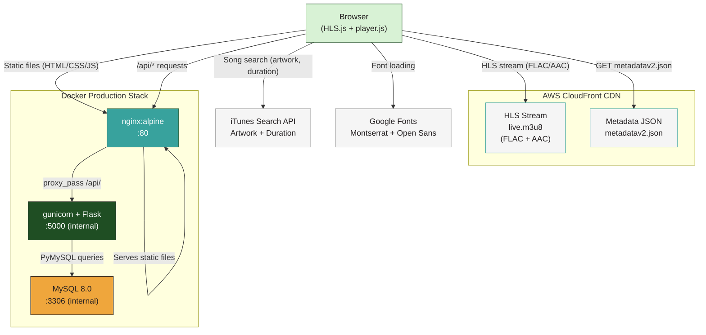
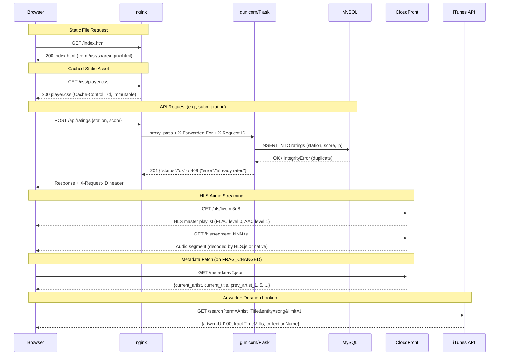
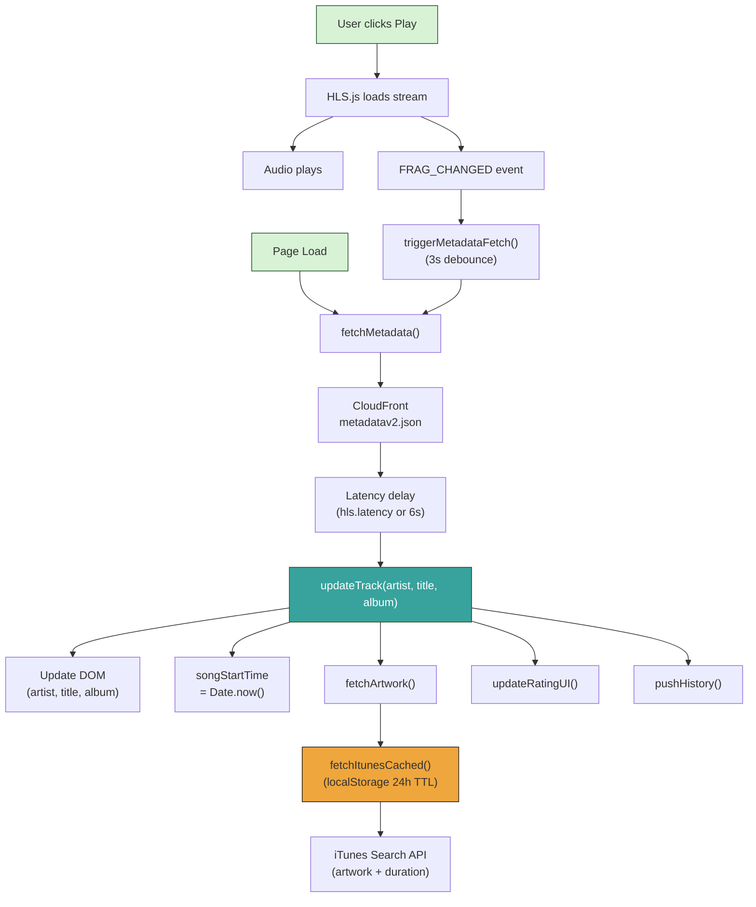
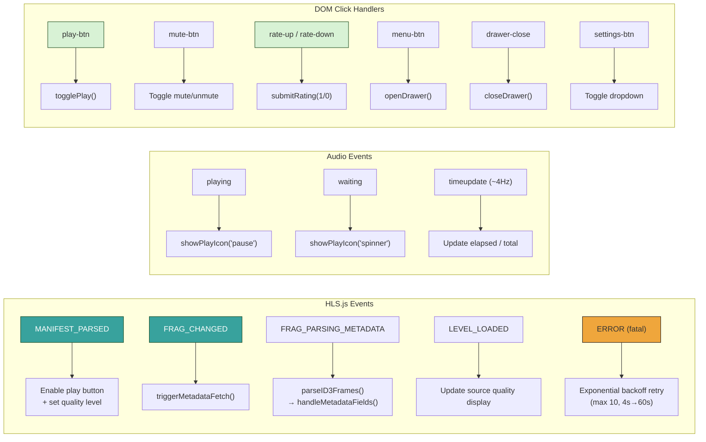
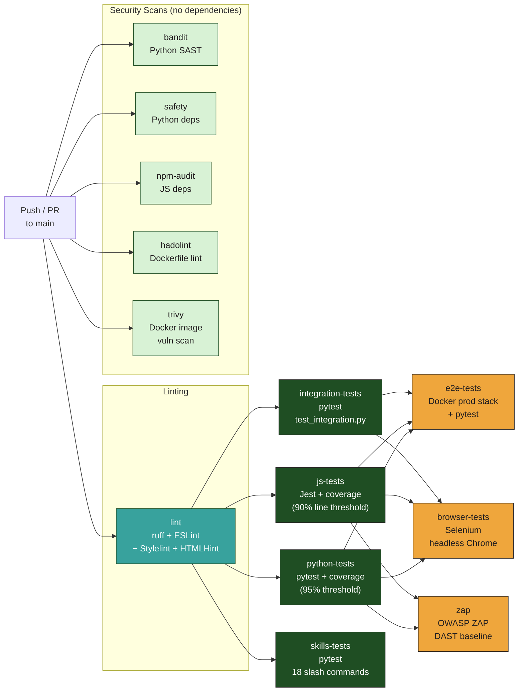
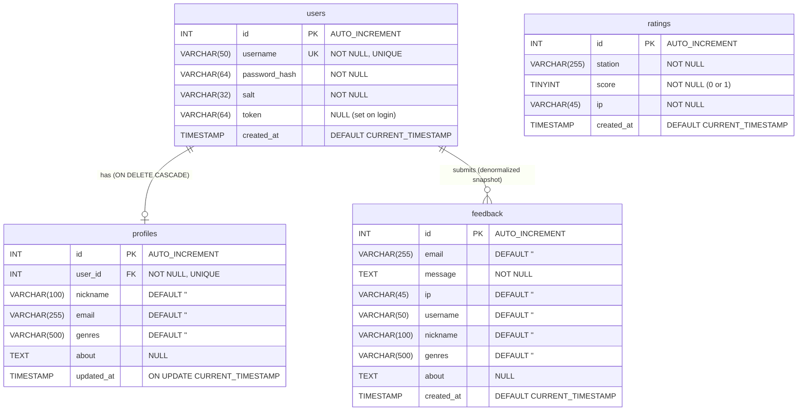
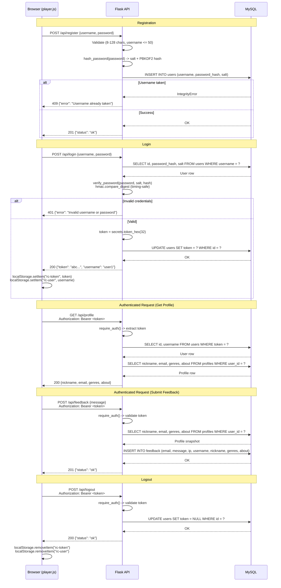

# Radio Calico - Architecture Diagrams

## Table of Contents

1. [System Architecture](#1-system-architecture)
2. [Request Flow](#2-request-flow)
3. [Data Flow — Playback & Metadata](#3-data-flow--playback--metadata)
4. [Data Flow — User Interactions](#4-data-flow--user-interactions)
5. [Event-Driven Architecture](#5-event-driven-architecture)
6. [CI/CD Pipeline](#6-cicd-pipeline)
7. [Database Schema](#7-database-schema)
8. [Authentication Flow](#8-authentication-flow)
9. [Claude Code Agents](#9-claude-code-agents)

---

## 1. System Architecture

High-level overview of all components and how they connect. In production, nginx serves static files directly and proxies `/api/` requests to gunicorn/Flask. The browser also communicates directly with CloudFront for HLS streaming and metadata, with iTunes for artwork/duration, and with Google Fonts for typography.

---

## 2. Request Flow

Sequence diagram showing the four main request types: static file serving, API calls through the nginx reverse proxy, HLS streaming from CloudFront, and artwork lookups from iTunes.

---

## 3. Data Flow — Playback & Metadata

How track metadata flows from CloudFront through the player to the UI, including latency compensation, iTunes artwork caching, and history accumulation.

---

## 4. Data Flow — User Interactions

How user actions (rating, sharing, auth, profile, feedback, theme, quality) flow through the system from UI click to API/state change.

```mermaid
graph TD
    subgraph Rating
        RClick["Click thumbs up/down"] --> SR["submitRating(score)"]
        SR --> PostRate["POST /api/ratings"]
        PostRate --> FTR["fetchTrackRatings()"]
        FTR --> Counts["Update like/dislike counts"]
    end

    subgraph Sharing
        SClick["Click share button"] --> GST["getShareText() /<br/>getRecentlyPlayedText()"]
        GST --> WO["window.open(URL)"]
    end

    subgraph Auth
        Login["Submit login form"] --> PostLogin["POST /api/login"]
        PostLogin --> Token["Store token in localStorage"]
        Token --> Profile["showProfileView() → loadProfile()"]
        Logout["Click logout"] --> PostLogout["POST /api/logout"]
        PostLogout --> Clear["Clear localStorage"]
        Clear --> AuthView["showAuthView()"]
    end

    subgraph Settings
        Theme["Toggle theme radio"] --> AT["applyTheme()"]
        AT --> DT["data-theme attribute"]
        AT --> LS["localStorage rc-theme"]
        Quality["Toggle quality radio"] --> ASQ["applyStreamQuality()"]
        ASQ --> Init["initHls() + localStorage"]
    end

    style RClick fill:#D8F2D5,stroke:#1F4E23
    style SClick fill:#D8F2D5,stroke:#1F4E23
    style Login fill:#D8F2D5,stroke:#1F4E23
    style Logout fill:#D8F2D5,stroke:#1F4E23
    style Theme fill:#D8F2D5,stroke:#1F4E23
    style Quality fill:#D8F2D5,stroke:#1F4E23
```

---

## 5. Event-Driven Architecture

All HLS.js events, audio element events, and DOM event handlers that drive the player's behavior.

---

## 6. CI/CD Pipeline

GitHub Actions workflow (13 jobs) triggered on push/PR to `main`. Lint runs first, then test jobs in parallel. Security scans run independently. E2E, browser, and ZAP run after test jobs complete.

---

## 7. Database Schema

Entity-relationship diagram of the four MySQL tables. The `profiles` table has a foreign key to `users` (one-to-one). The `feedback` table stores a snapshot of the user's profile at submission time (denormalized). The `ratings` table is independent, keyed by station + IP.

---

## 8. Authentication Flow

Complete lifecycle from registration through login, authenticated operations (profile and feedback), and logout. Tokens are generated server-side with `secrets.token_hex(32)` and stored in both the database and the client's `localStorage`.

---

## 9. Claude Code Agents

Nine task-specific AI agents in `.claude/agents/`, each with specialized knowledge and workflows for Radio Calico development. Agents complement the 18 slash commands by providing persistent, context-aware personalities for recurring development concerns.

```mermaid
graph TD
    Dev["Developer<br/>(Claude Code CLI)"]

    subgraph Agents[".claude/agents/"]
        QA["QA Engineer<br/>qa-engineer.md"]
        DBA["DBA<br/>dba.md"]
        FE["Frontend Reviewer<br/>frontend-reviewer.md"]
        DO["DevOps<br/>devops.md"]
        API["API Designer<br/>api-designer.md"]
        RM["Release Manager<br/>release-manager.md"]
        SA["Security Auditor<br/>security-auditor.md"]
        PA["Performance Analyst<br/>performance-analyst.md"]
        DW["Documentation Writer<br/>documentation-writer.md"]
    end

    subgraph Codebase["Project Files"]
        Tests["Tests<br/>582 across 6 suites"]
        Schema["Database<br/>db/init.sql (4 tables)"]
        Static["Frontend<br/>static/ (JS + CSS + HTML)"]
        Docker["Infrastructure<br/>Docker + nginx + CI"]
        Flask["API<br/>api/app.py (Flask)"]
        Git["Git + GitHub<br/>PRs, CI, Releases"]
        Security["Security<br/>6 scanning tools"]
        Perf["Caching + CDN<br/>Optimization"]
        Docs["Documentation<br/>docs/ (5 documents)"]
    end

    Dev --> QA
    Dev --> DBA
    Dev --> FE
    Dev --> DO
    Dev --> API
    Dev --> RM
    Dev --> SA
    Dev --> PA
    Dev --> DW

    QA --> Tests
    DBA --> Schema
    FE --> Static
    DO --> Docker
    API --> Flask
    RM --> Git
    SA --> Security
    PA --> Perf
    DW --> Docs

    style Dev fill:#D8F2D5,stroke:#1F4E23,color:#231F20
    style QA fill:#38A29D,stroke:#1F4E23,color:#FFFFFF
    style DBA fill:#38A29D,stroke:#1F4E23,color:#FFFFFF
    style FE fill:#38A29D,stroke:#1F4E23,color:#FFFFFF
    style DO fill:#38A29D,stroke:#1F4E23,color:#FFFFFF
    style API fill:#38A29D,stroke:#1F4E23,color:#FFFFFF
    style RM fill:#38A29D,stroke:#1F4E23,color:#FFFFFF
    style SA fill:#38A29D,stroke:#1F4E23,color:#FFFFFF
    style PA fill:#38A29D,stroke:#1F4E23,color:#FFFFFF
    style DW fill:#38A29D,stroke:#1F4E23,color:#FFFFFF
    style Tests fill:#1F4E23,stroke:#231F20,color:#FFFFFF
    style Schema fill:#EFA63C,stroke:#231F20,color:#231F20
    style Static fill:#1F4E23,stroke:#231F20,color:#FFFFFF
    style Docker fill:#1F4E23,stroke:#231F20,color:#FFFFFF
    style Flask fill:#1F4E23,stroke:#231F20,color:#FFFFFF
    style Git fill:#1F4E23,stroke:#231F20,color:#FFFFFF
    style Security fill:#1F4E23,stroke:#231F20,color:#FFFFFF
    style Perf fill:#EFA63C,stroke:#231F20,color:#231F20
    style Docs fill:#1F4E23,stroke:#231F20,color:#FFFFFF
```

