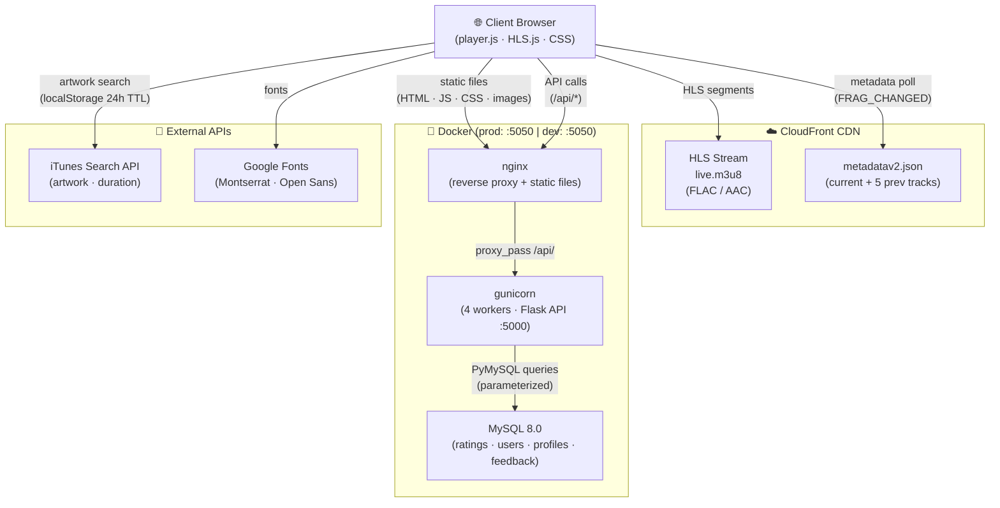
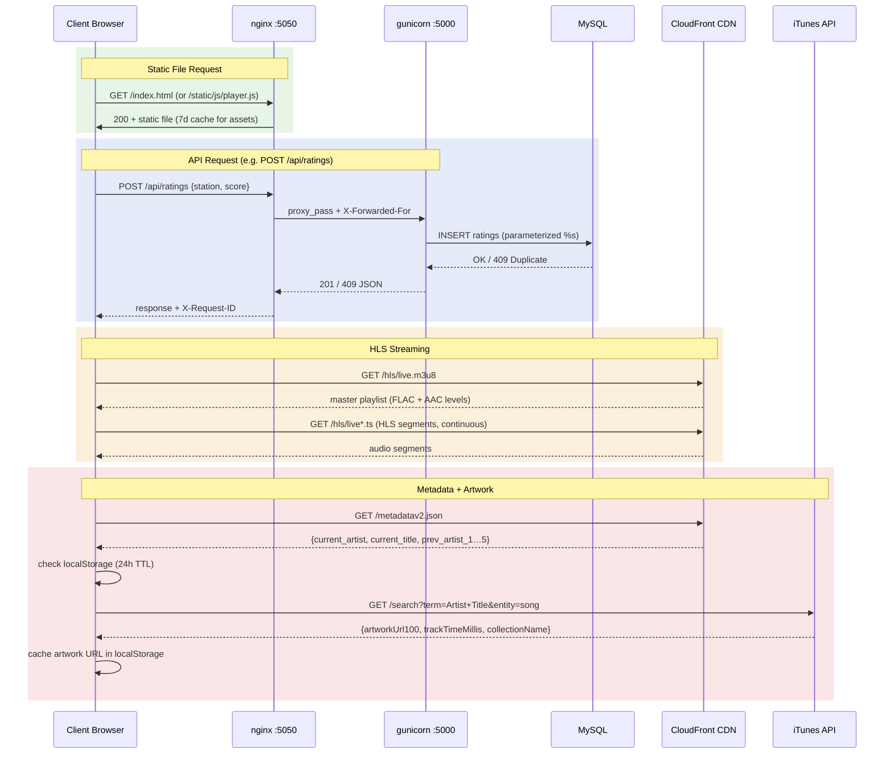
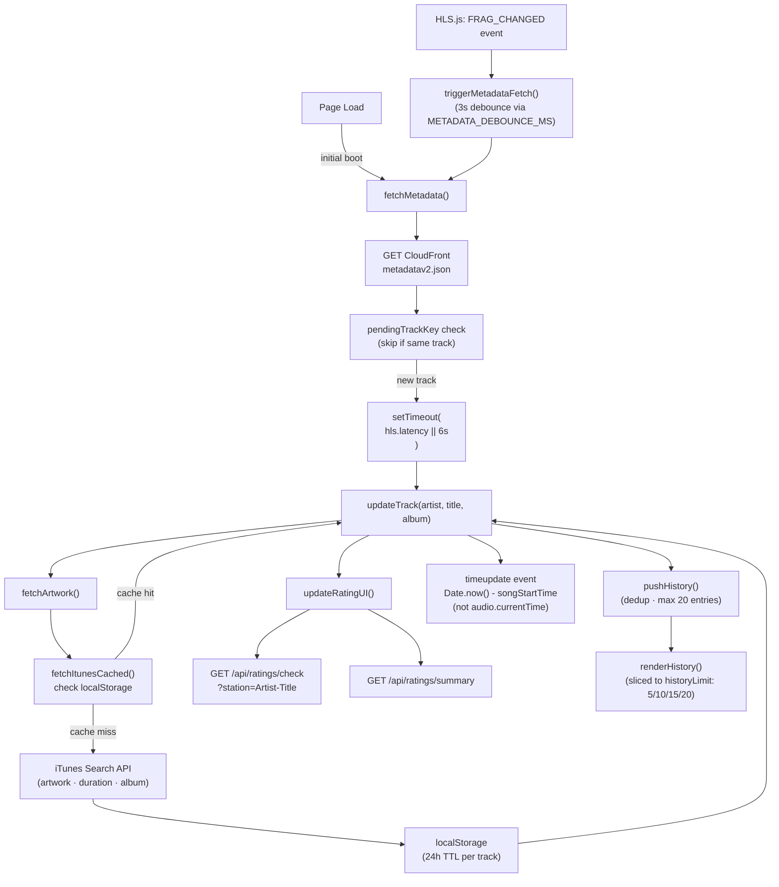
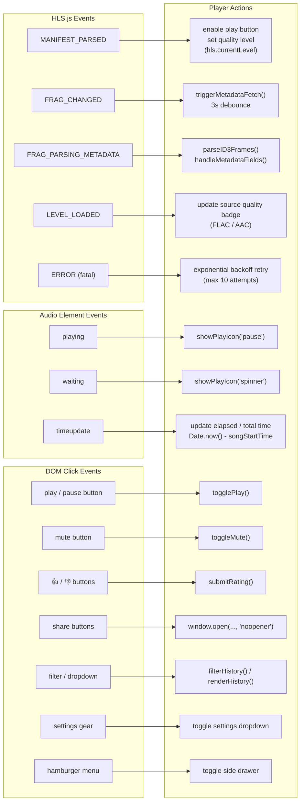
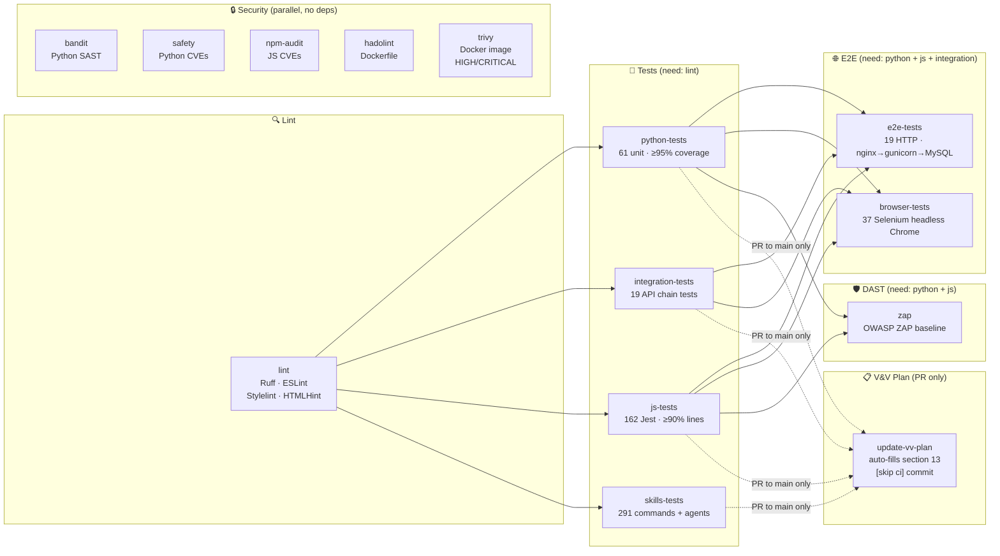
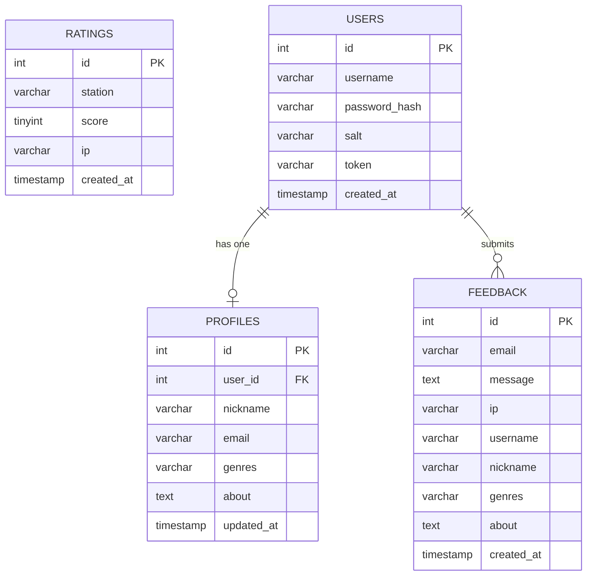
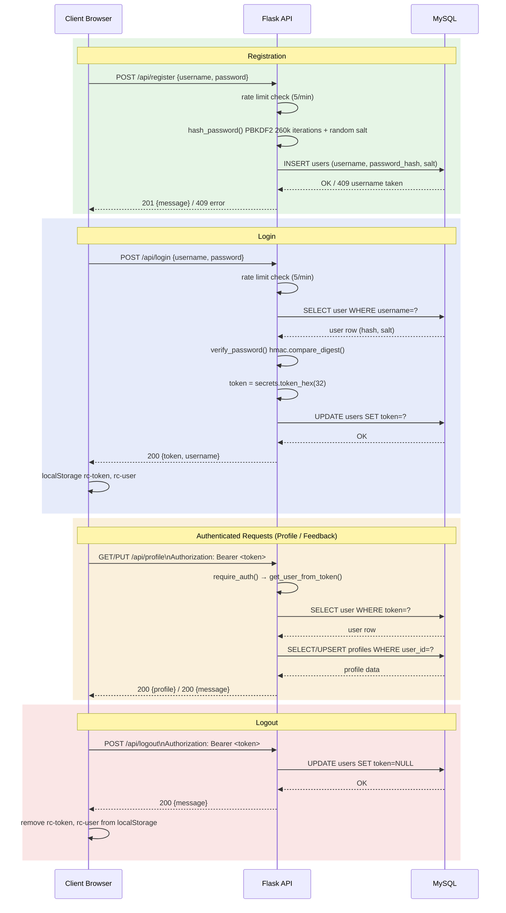

<table><tr>
<td valign="middle">

# Radio Calico - Architecture Diagrams

| Field | Value |
| --- | --- |
| **Project** | Radio Calico |
| **Version** | 1.0.0 |
| **Date** | 2026-03-18 |
| **Status** | Living document |

</td>
<td valign="middle" width="20%" align="right"></td>
</tr></table>

---

## Table of Contents

1. [System Architecture](#1-system-architecture)
2. [Request Flow](#2-request-flow)
3. [Data Flow — Playback & Metadata](#3-data-flow--playback--metadata)
4. [Data Flow — User Interactions](#4-data-flow--user-interactions)
5. [Event-Driven Architecture](#5-event-driven-architecture)
6. [CI/CD Pipeline](#6-cicd-pipeline)
7. [Database Schema](#7-database-schema)
8. [Authentication Flow](#8-authentication-flow)

---

## 1. System Architecture

High-level overview of all components and their relationships.

---

## 2. Request Flow

Sequence of HTTP requests for each major interaction type.

---

## 3. Data Flow — Playback & Metadata

How metadata is fetched, delayed, and applied to update the UI.

---

## 4. Data Flow — User Interactions

How user actions flow through the frontend and backend.

```mermaid
graph TD
    subgraph Ratings["👍 Ratings"]
        ThumbClick["click 👍 / 👎"]
        SubmitRating["submitRating()\nPOST /api/ratings"]
        FetchTrackRatings["fetchTrackRatings()\nGET /api/ratings/summary"]
        ThumbClick --> SubmitRating --> FetchTrackRatings
    end

    subgraph Share["📤 Share & Search"]
        ShareNow["click share (Now Playing)\ngetShareText()"]
        ShareRecent["click share (Recently Played)\ngetRecentlyPlayedText()"]
        WindowOpen["window.open(..., 'noopener')\nWhatsApp · X · Telegram · Spotify · YT Music · Amazon"]
        ShareNow --> WindowOpen
        ShareRecent --> WindowOpen
    end

    subgraph Auth["🔐 Auth"]
        RegisterForm["register form\nPOST /api/register"]
        LoginForm["login form\nPOST /api/login"]
        Token["token → localStorage\n(rc-token · rc-user)"]
        LogoutBtn["logout\nPOST /api/logout"]
        RegisterForm --> Token
        LoginForm --> Token
        Token --> LogoutBtn
    end

    subgraph Profile["👤 Profile"]
        ProfileForm["profile form\nPUT /api/profile\n(nickname · email · genres · about)"]
        ProfileConfirm["confirmation message"]
        ProfileForm --> ProfileConfirm
    end

    subgraph Feedback["💬 Feedback"]
        FeedbackForm["feedback form\nPOST /api/feedback\n(message + profile snapshot)"]
        FeedbackConfirm["confirmation message"]
        FeedbackForm --> FeedbackConfirm
    end

    subgraph Preferences["⚙️ Settings"]
        ThemeToggle["theme radio button\napplyTheme()\ndata-theme attr + localStorage rc-theme"]
        QualityToggle["quality radio button\napplyStreamQuality()\ninitHls() + localStorage rc-stream-quality"]
        ThemeToggle -->|"light / dark"| HTMLAttr["html[data-theme]"]
        QualityToggle -->|"FLAC level 0 / AAC level 1"| HLSLevel["hls.currentLevel\nhls.loadLevel"]
    end
```

---

## 5. Event-Driven Architecture

How HLS.js and DOM events drive the player state machine.

---

## 6. CI/CD Pipeline

GitHub Actions jobs and their dependencies.

---

## 7. Database Schema

Entity-relationship diagram for all four tables.

Notes:

- `ratings.score`: `1` = thumbs up, `0` = thumbs down
- `UNIQUE(station, ip)` on ratings prevents duplicate votes per track per IP
- `profiles.user_id` is UNIQUE — one profile per user, CASCADE delete on user removal
- `feedback` stores a full profile snapshot at submission time (denormalized by design)
- IP addresses are stored server-side only and never exposed in API responses (S-8)

---

## 8. Authentication Flow

Full lifecycle from registration to logout.

