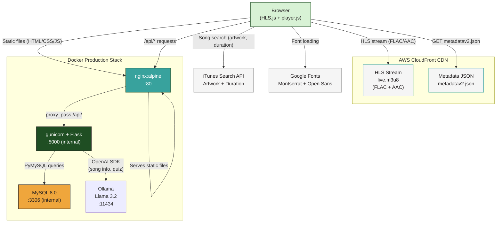
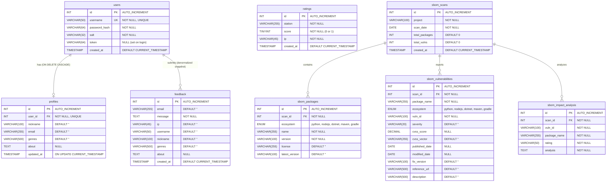
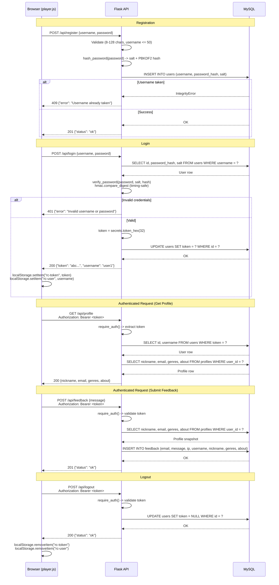
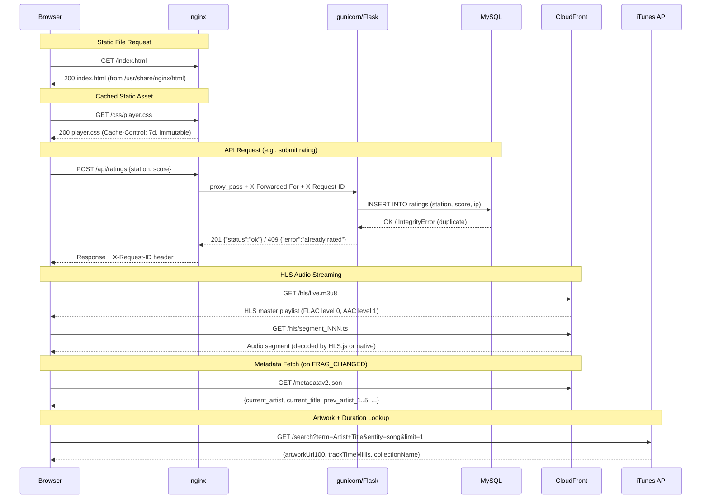
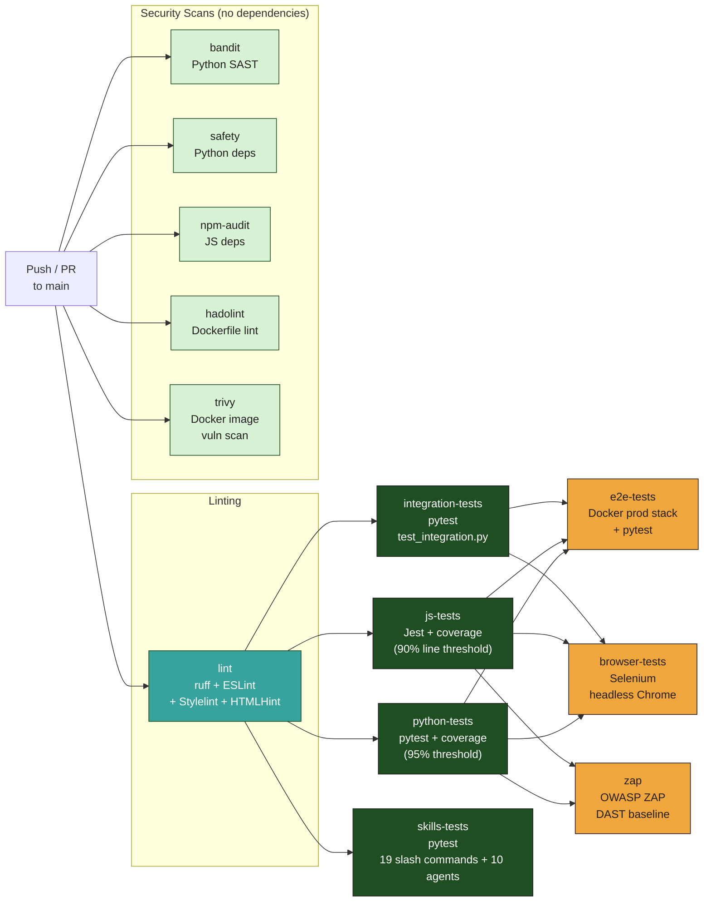

<table><tr>
<td valign="middle">

# Radio Calico — Technical Specification

| Field | Value |
| --- | --- |
| **Project** | Radio Calico |
| **Version** | 2.0.0 |
| **Date** | 2026-03-21 |
| **Status** | Living document |

</td>
<td valign="middle" width="20%" align="right"></td>
</tr></table>

---

## Table of Contents

1. [Executive Summary](#1-executive-summary)
2. [System Architecture](#2-system-architecture)
3. [Technology Stack](#3-technology-stack)
4. [API Reference](#4-api-reference)
5. [Database Schema](#5-database-schema)
6. [Authentication & Security](#6-authentication--security)
7. [Deployment Architecture](#7-deployment-architecture)
8. [Observability](#8-observability)
9. [Testing Strategy](#9-testing-strategy)
10. [Performance Optimizations](#10-performance-optimizations)
11. [Configuration](#11-configuration)
12. [Known Limitations & Future Work](#12-known-limitations--future-work)

---

## 1. Executive Summary

Radio Calico is a live audio streaming web player with a Python Flask backend for track ratings, user accounts, feedback, and AI-powered song information. The application streams audio via HLS from AWS CloudFront in two user-selectable quality levels (48 kHz FLAC lossless and AAC Hi-Fi 211 kbps), displays real-time track metadata from a CloudFront JSON endpoint, fetches album artwork and duration from the iTunes Search API, and allows users to rate tracks, manage profiles, submit feedback, and explore song details (lyrics, facts, merchandise, jokes, quiz) via a local LLM. All user-generated data is stored locally in MySQL.

The frontend is a vanilla JavaScript single-page application with no build step or framework dependency, featuring retro radio buttons for AI-powered song information, an interactive quiz game, and i18n support (English, Brazilian Portuguese, Spanish). The backend is a stateless Flask REST API accessed through PyMySQL with parameterized queries, with an LLM service layer (Ollama + Llama 3.2 via OpenAI SDK). In production, the stack runs in Docker containers with nginx serving static files and reverse-proxying API requests to gunicorn, with Ollama providing local LLM inference. The project includes 843 automated tests across 8 test suites, 6 security scanning tools, 4 linters, and a GitHub Actions CI pipeline with 13+ parallel jobs.

---

## 2. System Architecture

High-level overview of all components and how they connect. In production, nginx serves static files directly and proxies `/api/` requests to gunicorn/Flask. The browser also communicates directly with CloudFront for HLS streaming and metadata, with iTunes for artwork/duration, and with Google Fonts for typography.



### Component Summary

| Component | Role |
|-----------|------|
| **Browser** | HLS.js decodes audio stream; player.js manages UI, metadata, ratings, auth, sharing, retro radio buttons, AI info panel, quiz game, i18n |
| **CloudFront CDN** | Delivers HLS audio segments and track metadata JSON |
| **nginx** | Serves static files (HTML/CSS/JS/images), reverse-proxies `/api/` to gunicorn, adds security headers |
| **gunicorn + Flask** | Stateless REST API for ratings, auth, profiles, feedback, song info, quiz |
| **MySQL 8.0** | Persistent storage for ratings, users, profiles, feedback, SBOM history (8 tables) |
| **Ollama + Llama 3.2** | Local LLM for song info (lyrics, details, facts, merchandise, jokes, everything) and interactive quiz. Host GPU fallback for fast inference on macOS |
| **iTunes Search API** | Client-side lookups for album artwork (300x300), track duration, album name |
| **Google Fonts** | Montserrat (headings) and Open Sans (body) loaded client-side |

---

## 3. Technology Stack

| Layer | Technology | Purpose |
|-------|-----------|---------|
| **Frontend** | Vanilla JavaScript (ES2020) | Playback, metadata, ratings, auth, sharing, retro radio buttons, AI info panel, quiz game, i18n -- no framework or bundler |
| **Frontend** | HTML5 + CSS3 | Single-page markup with CSS custom properties and responsive layout |
| **Frontend** | HLS.js 1.x | HLS stream decoding for non-Safari browsers |
| **Frontend** | Native HLS | Safari uses built-in `<audio>` HLS support |
| **Backend** | Python 3.11 | Runtime for Flask API |
| **Backend** | Flask 3.x | Lightweight REST API framework |
| **Backend** | PyMySQL | Pure-Python MySQL client with parameterized queries |
| **Backend** | Flask-CORS | Cross-origin resource sharing for API endpoints |
| **Backend** | Flask-Limiter | Rate limiting on auth endpoints (in-memory storage) |
| **Backend** | python-json-logger | Structured JSON log output |
| **Backend** | python-dotenv | Environment variable loading from `.env` files |
| **Backend** | OpenAI SDK (Python) | OpenAI-compatible client for Ollama LLM queries |
| **LLM** | Ollama + Llama 3.2 | Local LLM for song info (lyrics, details, facts, merchandise, jokes, quiz). Host GPU fallback on macOS |
| **Database** | MySQL 5.7 (local) / 8.0 (Docker) | Relational storage for ratings, users, profiles, feedback, SBOM history (8 tables) |
| **Web Server** | nginx:alpine | Static file serving, reverse proxy, security headers, gzip |
| **App Server** | gunicorn 22.0 | WSGI server, 4 worker processes in production |
| **Streaming** | AWS CloudFront | HLS live stream delivery (FLAC + AAC) and metadata JSON |
| **External API** | iTunes Search API | Album artwork, track duration, collection name |
| **Typography** | Google Fonts | Montserrat + Open Sans web fonts |
| **Containerization** | Docker + Docker Compose | Multi-stage builds, dev/prod profiles |
| **CI/CD** | GitHub Actions | 13+ job pipeline: lint, test, security, E2E, browser, DAST, SBOM, V&V |
| **Testing** | pytest + pytest-cov | Python unit/integration tests with coverage |
| **Testing** | Jest + jsdom | JavaScript unit tests with DOM simulation |
| **Linting** | Ruff, ESLint, Stylelint, HTMLHint | Code quality across Python, JS, CSS, HTML |
| **Security** | Bandit, Safety, npm audit, Hadolint, Trivy, OWASP ZAP | SAST, dependency scanning, image scanning, DAST |

---

## 4. API Reference

All API routes use the `/api` prefix. The backend runs on port 5000 (internal). In Docker production, nginx proxies `/api/` requests to gunicorn.

### 4.1 Ratings (no authentication required)

#### GET /api/ratings

List all ratings, ordered by most recent first, with optional pagination.

| Parameter | In | Type | Default | Description |
|-----------|----|------|---------|-------------|
| `limit` | query | int | 100 | Maximum results (max 500) |
| `offset` | query | int | 0 | Number of results to skip |

**Response** `200 OK`:
```json
[
  {
    "id": 1,
    "station": "Artist - Title",
    "score": 1,
    "created_at": "2026-03-17T12:00:00"
  }
]
```

Response header: `Cache-Control: public, max-age=30`

Note: IP addresses are never exposed in the response.

---

#### GET /api/ratings/summary

Aggregated likes and dislikes per station.

**Response** `200 OK`:
```json
{
  "Artist - Title": {
    "likes": 5,
    "dislikes": 2
  }
}
```

---

#### GET /api/ratings/check

Check whether the current client IP has already rated a station.

| Parameter | In | Type | Required | Description |
|-----------|----|------|----------|-------------|
| `station` | query | string | Yes | Track identifier (`"Artist - Title"`) |

**Response** `200 OK`:
```json
{"rated": true, "score": 1}
```
or
```json
{"rated": false}
```

---

#### POST /api/ratings

Submit a rating (like or dislike) for a track.

**Request body**:
```json
{
  "station": "Artist - Title",
  "score": 1
}
```

| Field | Type | Constraints |
|-------|------|-------------|
| `station` | string | Required, non-empty |
| `score` | int | Required, must be `0` (dislike) or `1` (like) |

**Responses**:

| Status | Body | Condition |
|--------|------|-----------|
| `201 Created` | `{"status": "ok"}` | Rating saved |
| `400 Bad Request` | `{"error": "..."}` | Invalid JSON, missing fields, or invalid score |
| `409 Conflict` | `{"error": "already rated"}` | IP has already rated this station |

---

### 4.2 Authentication

#### POST /api/register

Create a new user account. **Rate-limited to 5 requests/minute per IP.**

**Request body**:
```json
{
  "username": "user1",
  "password": "securepass"
}
```

| Field | Type | Constraints |
|-------|------|-------------|
| `username` | string | Required, max 50 characters |
| `password` | string | Required, 8--128 characters |

**Responses**:

| Status | Body | Condition |
|--------|------|-----------|
| `201 Created` | `{"status": "ok"}` | Account created |
| `400 Bad Request` | `{"error": "..."}` | Missing fields, length violations |
| `409 Conflict` | `{"error": "Username already taken"}` | Duplicate username |
| `429 Too Many Requests` | Rate limit error | More than 5 requests/minute |

---

#### POST /api/login

Authenticate and receive a bearer token. **Rate-limited to 5 requests/minute per IP.**

**Request body**:
```json
{
  "username": "user1",
  "password": "securepass"
}
```

**Responses**:

| Status | Body | Condition |
|--------|------|-----------|
| `200 OK` | `{"token": "abc...", "username": "user1"}` | Authenticated |
| `400 Bad Request` | `{"error": "..."}` | Missing fields |
| `401 Unauthorized` | `{"error": "Invalid username or password"}` | Wrong credentials |
| `429 Too Many Requests` | Rate limit error | More than 5 requests/minute |

---

#### POST /api/logout

Invalidate the current bearer token. **Requires `Authorization: Bearer <token>`.**

**Responses**:

| Status | Body | Condition |
|--------|------|-----------|
| `200 OK` | `{"status": "ok"}` | Token cleared |
| `401 Unauthorized` | `{"error": "Unauthorized"}` | Missing or invalid token |

---

### 4.3 Profile (requires `Authorization: Bearer <token>`)

#### GET /api/profile

Retrieve the authenticated user's profile.

**Response** `200 OK`:
```json
{
  "nickname": "DJ Cat",
  "email": "cat@example.com",
  "genres": "Jazz,Electronic",
  "about": "Music lover"
}
```

Returns empty strings for all fields if no profile exists yet.

| Status | Condition |
|--------|-----------|
| `200 OK` | Profile returned |
| `401 Unauthorized` | Missing or invalid token |

---

#### PUT /api/profile

Create or update the authenticated user's profile (upsert).

**Request body**:
```json
{
  "nickname": "DJ Cat",
  "email": "cat@example.com",
  "genres": "Jazz,Electronic",
  "about": "Music lover"
}
```

| Field | Type | Max Length |
|-------|------|-----------|
| `nickname` | string | 100 |
| `email` | string | 255 |
| `genres` | string | 500 |
| `about` | string | 1000 |

**Responses**:

| Status | Body | Condition |
|--------|------|-----------|
| `200 OK` | `{"status": "ok"}` | Profile saved |
| `400 Bad Request` | `{"error": "Invalid JSON"}` | Missing JSON body |
| `401 Unauthorized` | `{"error": "Unauthorized"}` | Missing or invalid token |

---

### 4.4 Feedback (requires `Authorization: Bearer <token>`)

#### POST /api/feedback

Submit feedback. The record includes a snapshot of the user's profile at the time of submission.

**Request body**:
```json
{
  "message": "Great station!"
}
```

**Responses**:

| Status | Body | Condition |
|--------|------|-----------|
| `201 Created` | `{"status": "ok"}` | Feedback saved |
| `400 Bad Request` | `{"error": "..."}` | Invalid JSON or empty message |
| `401 Unauthorized` | `{"error": "Login required to send feedback"}` | Missing or invalid token |

---

### 4.5 Health (nginx only, production)

#### GET /health

Returns `200 "ok"` as plain text. Served directly by nginx (not proxied to Flask). Used by Docker health checks and load balancers.

---

### 4.6 Song Info (LLM)

#### POST /api/song-info

Query the LLM for song information. Rate-limited to 10 requests/minute.

| Field | Type | Required | Description |
|-------|------|----------|-------------|
| `query_type` | string | Yes | One of: `lyrics`, `details`, `facts`, `merchandise`, `jokes`, `everything` |
| `artist` | string | Yes | Artist name |
| `track` | string | Yes | Track title |
| `album` | string | No | Album name (defaults to "Unknown") |
| `artwork_url` | string | No | Album artwork URL for context |
| `language` | string | No | Response language (defaults to English) |

**Response:** `{ "ok": true, "content": "markdown..." }` or `{ "ok": false, "error": "..." }`

Responses are cached for 24 hours keyed by `(query_type, artist, track, language)`.

#### GET /api/song-info/health

Health check for the LLM backend. Returns `{ "ok": true/false, "ollama": true/false, "model": "llama3.2", "model_available": true/false }`.

---

### 4.7 Quiz (LLM)

#### POST /api/quiz/start

Start an interactive 5-question quiz about the current song. Rate-limited to 10 requests/minute.

| Field | Type | Required | Description |
|-------|------|----------|-------------|
| `artist` | string | Yes | Artist name |
| `track` | string | Yes | Track title |
| `album` | string | No | Album name |
| `language` | string | No | Quiz language (defaults to English) |

**Response:** `{ "ok": true, "session_id": "...", "question": "...", "question_number": 1, "total_questions": 5 }`

#### POST /api/quiz/answer

Submit an answer to the current quiz question.

| Field | Type | Required | Description |
|-------|------|----------|-------------|
| `session_id` | string | Yes | Quiz session ID from `/api/quiz/start` |
| `answer` | string | Yes | User's answer |

**Response (mid-quiz):** `{ "ok": true, "score": 5, "feedback": "...", "question": "...", "question_number": 2 }`

**Response (final):** `{ "ok": true, "score": -3, "feedback": "...", "summary": { "total": 12, "max": 25, "verdict": "..." } }`

Scoring: -5 to +5 per question. The LLM evaluates how close the answer is and provides sarcastic feedback.

#### POST /api/song-info/stream

Streaming version of `/api/song-info`. Returns Server-Sent Events (SSE) with JSON-encoded chunks.

Same request body as `/api/song-info`. Response is `text/event-stream`:

- `data: "chunk text"\n\n` — each token as JSON string (preserves newlines)
- `event: error\ndata: "message"\n\n` — on error
- `event: done\ndata: \n\n` — stream complete

Falls back to cached response (single chunk) if available.

#### POST /api/chat

Follow-up conversation about a song. Returns SSE-streamed response.

| Field | Type | Required | Description |
| ----- | ---- | -------- | ----------- |
| `messages` | array | Yes | `[{"role": "user", "content": "..."}]` conversation history |
| `artist` | string | Yes | Current artist |
| `track` | string | Yes | Current track |
| `album` | string | No | Current album |
| `language` | string | No | Response language |

Response: SSE stream (same format as `/api/song-info/stream`).

#### POST /api/taste-profile

Generate a music taste personality profile from rated songs.

| Field | Type | Required | Description |
|-------|------|----------|-------------|
| `liked` | array | No | `["Artist - Track", ...]` |
| `disliked` | array | No | `["Artist - Track", ...]` |
| `language` | string | No | Response language |

**Response:** `{ "ok": true, "content": "## Your Music DNA\n..." }`

Generates: personality title, music DNA bullets, witty analysis, song recommendation, sarcastic observation about dislikes.

---

### 4.8 Static Files

#### GET /

Serves `static/index.html` via Flask's `send_from_directory`. In production, nginx serves static files directly from `/usr/share/nginx/html`.

---

## 5. Database Schema

The application uses 8 MySQL tables: 4 app tables and 4 SBOM history tables. The `profiles` table has a foreign key to `users` (one-to-one, cascade on delete). The `feedback` table stores a denormalized snapshot of the user's profile at submission time. The `ratings` table is independent, keyed by station + IP with a unique constraint to prevent duplicate votes. The SBOM tables (`sbom_scans`, `sbom_packages`, `sbom_vulnerabilities`, `sbom_impact_analysis`) store dependency scan history with cascade deletes from `sbom_scans`.



### Table Details

#### ratings

Stores track ratings (likes/dislikes) identified by station name and client IP.

| Column | Type | Constraints | Description |
|--------|------|-------------|-------------|
| `id` | INT | PK, AUTO_INCREMENT | Unique identifier |
| `station` | VARCHAR(255) | NOT NULL | Track identifier (`"Artist - Title"`) |
| `score` | TINYINT | NOT NULL | `1` = like, `0` = dislike |
| `ip` | VARCHAR(45) | NOT NULL | Client IP (supports IPv6) |
| `created_at` | TIMESTAMP | DEFAULT CURRENT_TIMESTAMP | When the rating was submitted |

**Unique constraint**: `UNIQUE KEY unique_rating (station, ip)` prevents duplicate votes from the same IP for the same track.

#### users

Stores registered user accounts with hashed credentials and optional auth tokens.

| Column | Type | Constraints | Description |
|--------|------|-------------|-------------|
| `id` | INT | PK, AUTO_INCREMENT | Unique identifier |
| `username` | VARCHAR(50) | NOT NULL, UNIQUE | Login name |
| `password_hash` | VARCHAR(64) | NOT NULL | PBKDF2-HMAC-SHA256 hex digest |
| `salt` | VARCHAR(32) | NOT NULL | Random 16-byte hex-encoded salt |
| `token` | VARCHAR(64) | DEFAULT NULL | Active auth token (set on login, cleared on logout) |
| `created_at` | TIMESTAMP | DEFAULT CURRENT_TIMESTAMP | Registration time |

#### profiles

One-to-one extension of the users table with display information.

| Column | Type | Constraints | Description |
|--------|------|-------------|-------------|
| `id` | INT | PK, AUTO_INCREMENT | Unique identifier |
| `user_id` | INT | NOT NULL, UNIQUE, FK | References `users(id)` ON DELETE CASCADE |
| `nickname` | VARCHAR(100) | DEFAULT '' | Display name |
| `email` | VARCHAR(255) | DEFAULT '' | Email address |
| `genres` | VARCHAR(500) | DEFAULT '' | Comma-separated music genre tags |
| `about` | TEXT | NULL | Free-text bio |
| `updated_at` | TIMESTAMP | ON UPDATE CURRENT_TIMESTAMP | Last profile edit |

#### feedback

Stores user feedback messages with a denormalized snapshot of the user's profile at submission time.

| Column | Type | Constraints | Description |
|--------|------|-------------|-------------|
| `id` | INT | PK, AUTO_INCREMENT | Unique identifier |
| `email` | VARCHAR(255) | DEFAULT '' | User's email at submission time |
| `message` | TEXT | NOT NULL | Feedback message body |
| `ip` | VARCHAR(45) | DEFAULT '' | Client IP address |
| `username` | VARCHAR(50) | DEFAULT '' | Login name at submission time |
| `nickname` | VARCHAR(100) | DEFAULT '' | Display name at submission time |
| `genres` | VARCHAR(500) | DEFAULT '' | Genre preferences at submission time |
| `about` | TEXT | NULL | Bio at submission time |
| `created_at` | TIMESTAMP | DEFAULT CURRENT_TIMESTAMP | Submission time |

---

## 6. Authentication & Security

### 6.1 Authentication Flow

Complete lifecycle from registration through login, authenticated operations (profile and feedback), and logout. Tokens are generated server-side with `secrets.token_hex(32)` and stored in both the database and the client's `localStorage`.



### 6.2 Password Hashing

- **Algorithm**: PBKDF2-HMAC-SHA256 with 260,000 iterations
- **Salt**: 16-byte random salt generated via `secrets.token_hex(16)`, stored as hex in the database
- **Hash output**: 32-byte SHA-256 digest stored as 64-character hex string
- **Verification**: Uses `hmac.compare_digest()` for constant-time comparison to prevent timing attacks

### 6.3 Token Management

- Tokens generated with `secrets.token_hex(32)` (64-character hex string, 256 bits of entropy)
- Stored in the `users.token` column (set on login, cleared to NULL on logout)
- Client sends token via `Authorization: Bearer <token>` header
- `require_auth()` extracts the token and performs a database lookup
- Only one active token per user (logging in again replaces the previous token)

### 6.4 Rate Limiting

- **Flask-Limiter** with in-memory storage (per-process)
- `POST /api/register`: 5 requests/minute per IP
- `POST /api/login`: 5 requests/minute per IP
- Returns `429 Too Many Requests` when exceeded

### 6.5 SQL Injection Prevention

All database queries use PyMySQL parameterized queries (`%s` placeholders). No string concatenation or f-strings are used in SQL statements.

### 6.6 XSS Prevention

- Frontend uses `escHtml()` for all user/metadata text inserted via `innerHTML`
- Content Security Policy header restricts script/style/media sources (see nginx headers below)

### 6.7 nginx Security Headers

The following headers are applied to all responses in production:

| Header | Value | Purpose |
|--------|-------|---------|
| `X-Content-Type-Options` | `nosniff` | Prevents MIME-type sniffing |
| `X-Frame-Options` | `SAMEORIGIN` | Prevents clickjacking |
| `X-XSS-Protection` | `1; mode=block` | Legacy XSS filter |
| `Referrer-Policy` | `strict-origin-when-cross-origin` | Controls referrer information |
| `Permissions-Policy` | `camera=(), microphone=(), geolocation=(), payment=()` | Disables unnecessary browser APIs |
| `Cross-Origin-Resource-Policy` | `same-origin` | Restricts resource loading to same origin |
| `Cross-Origin-Embedder-Policy` | `unsafe-none` | Allows embedding cross-origin resources (needed for CDN) |
| `Content-Security-Policy` | (see below) | Restricts content sources |
| `server_tokens` | `off` | Hides nginx version from responses |

**Content Security Policy directives**:

| Directive | Allowed Sources |
|-----------|----------------|
| `default-src` | `'self'` |
| `script-src` | `'self'`, `https://cdn.jsdelivr.net` |
| `style-src` | `'self'`, `'unsafe-inline'`, `https://fonts.googleapis.com` |
| `font-src` | `'self'`, `https://fonts.gstatic.com` |
| `img-src` | `'self'`, `https://is1-ssl.mzstatic.com`, `data:` |
| `media-src` | `'self'`, `https://d3d4yli4hf5bmh.cloudfront.net`, `blob:` |
| `connect-src` | `'self'`, `https://d3d4yli4hf5bmh.cloudfront.net`, `https://itunes.apple.com` |
| `worker-src` | `'self'`, `blob:` |
| `frame-ancestors` | `'self'` |
| `form-action` | `'self'` |
| `base-uri` | `'self'` |

### 6.8 IP-Based Rating Deduplication

- The `ratings` table has a `UNIQUE KEY unique_rating (station, ip)` constraint
- Client IP is extracted from `X-Forwarded-For` header (first IP if behind proxy) or `request.remote_addr`
- Duplicate rating attempts return `409 Conflict`

---

## 7. Deployment Architecture

### 7.1 Request Flow

Sequence diagram showing the four main request types: static file serving, API calls through the nginx reverse proxy, HLS streaming from CloudFront, and artwork lookups from iTunes.



### 7.2 Docker Production Stack

The production stack consists of three services orchestrated via Docker Compose with the `prod` profile.

| Service | Image/Build | Exposed Port | Internal Port | Role |
|---------|-------------|-------------|---------------|------|
| `db` | `mysql:8.0` | None | 3306 | Database with `mysql_native_password` auth plugin |
| `app` | Multi-stage `Dockerfile` (target: `prod`) | None | 5000 | gunicorn with 4 workers, non-root `appuser` |
| `nginx` | `nginx:alpine` | `${APP_PORT:-5050}` | 80 | Static files + reverse proxy |

**Service dependencies**:
- `app` depends on `db` (condition: `service_healthy`)
- `nginx` depends on `app` (condition: `service_healthy`)

**Volumes**:
- `mysql_data`: persistent MySQL data
- `./db/init.sql` mounted read-only for schema initialization
- `./nginx/nginx.conf` mounted read-only as nginx config
- `./static` mounted read-only as nginx document root

### 7.3 Docker Development Stack

The development stack uses the `dev` profile with a single Flask server (no nginx).

| Service | Image/Build | Exposed Port | Features |
|---------|-------------|-------------|----------|
| `db` | `mysql:8.0` | None | Same as production |
| `app-dev` | Multi-stage `Dockerfile` (target: `dev`) | `${APP_PORT:-5050}` | Flask debug mode, hot reload, source volumes mounted |

Development-specific features:
- `FLASK_DEBUG=true` for auto-reload on code changes
- `CORS_ORIGIN=*` for permissive development CORS
- `./api` and `./static` mounted as volumes for live editing
- Includes dev dependencies: pytest, bandit, safety, ruff, Node.js, npm, Jest

### 7.4 Dockerfile Multi-Stage Build

| Stage | Base | Contents | CMD |
|-------|------|----------|-----|
| `base` | `python:3.11-slim` | Non-root `appuser`, upgraded system packages, production pip dependencies, application code | -- |
| `prod` | `base` | `FLASK_DEBUG=false`, runs as `appuser` | `gunicorn --bind 0.0.0.0:5000 --workers 4 --chdir api app:app` |
| `dev` | `base` | Dev pip dependencies, Node.js + npm, test files, Jest config, Makefile | `python api/app.py` |

### 7.5 Health Checks

| Service | Check | Interval | Timeout | Retries |
|---------|-------|----------|---------|---------|
| `db` | `mysqladmin ping -h localhost` | 5s | 5s | 10 |
| `app` (prod) | HTTP GET `http://localhost:5000/api/ratings/summary` | 10s | 5s | 3 |
| `nginx` | `wget --spider -q http://localhost/health` | 10s | 5s | 3 |
| `app-dev` | `curl -f http://localhost:5000/` | 10s | 5s | 3 |

### 7.6 nginx Proxy Configuration

- Static files served from `/usr/share/nginx/html` with `try_files $uri $uri/ /index.html`
- API requests at `/api/` proxied to `http://app:5000`
- Proxy headers forwarded: `Host`, `X-Real-IP`, `X-Forwarded-For`, `X-Forwarded-Proto`, `X-Request-ID`
- Proxy timeouts: connect 10s, read 30s, send 30s
- Health endpoint at `/health` returns `200 "ok"` (access log disabled)

---

## 8. Observability

### 8.1 Structured JSON Logging

All three layers (Python, nginx, JavaScript) emit structured JSON logs with a shared set of fields for cross-layer correlation.

#### Python (Flask API)

Uses `python-json-logger` with a `JsonFormatter`. Every request is logged in the `after_request` hook.

**Log fields**:

| Field | Source | Example |
|-------|--------|---------|
| `timestamp` | `%(asctime)s` | `2026-03-17T12:00:00.000` |
| `level` | `%(levelname)s` | `INFO`, `WARNING`, `ERROR` |
| `logger` | `%(name)s` | `radiocalico` |
| `message` | Event name | `request`, `rating_created`, `user_registered` |
| `request_id` | `X-Request-ID` header or generated | `a1b2c3d4e5f6` |
| `method` | `request.method` | `POST` |
| `path` | `request.path` | `/api/ratings` |
| `status` | `response.status_code` | `201` |
| `duration_ms` | Computed | `12.5` |
| `ip` | `X-Forwarded-For` or `remote_addr` | `192.168.1.1` |
| `user_agent` | `User-Agent` header | `Mozilla/5.0...` |

**Log level routing**: 5xx responses are logged at `ERROR`, 4xx at `WARNING`, all others at `INFO`. Default werkzeug request logs are suppressed (`WARNING` level).

**Example output**:
```json
{"timestamp": "2026-03-17T12:00:00.123", "level": "INFO", "logger": "radiocalico", "message": "request", "request_id": "a1b2c3d4e5f6", "method": "POST", "path": "/api/ratings", "status": 201, "duration_ms": 12.5, "ip": "192.168.1.1", "user_agent": "Mozilla/5.0..."}
```

**Business event examples**:
```json
{"timestamp": "...", "level": "INFO", "logger": "radiocalico", "message": "rating_created", "station": "Artist - Title", "score": 1, "ip": "192.168.1.1"}
{"timestamp": "...", "level": "INFO", "logger": "radiocalico", "message": "user_registered", "username": "user1"}
{"timestamp": "...", "level": "INFO", "logger": "radiocalico", "message": "user_logged_in", "username": "user1"}
{"timestamp": "...", "level": "INFO", "logger": "radiocalico", "message": "feedback_submitted", "username": "user1"}
{"timestamp": "...", "level": "WARNING", "logger": "radiocalico", "message": "login_failed", "username": "user1"}
```

#### nginx

Uses a custom `json_log` format with `escape=json`.

**Log fields**:

| Field | nginx Variable | Example |
|-------|---------------|---------|
| `timestamp` | `$time_iso8601` | `2026-03-17T12:00:00+00:00` |
| `level` | Hardcoded | `INFO` |
| `logger` | Hardcoded | `nginx` |
| `message` | Hardcoded | `request` |
| `method` | `$request_method` | `POST` |
| `path` | `$uri` | `/api/ratings` |
| `status` | `$status` | `201` |
| `duration_ms` | `$request_time` | `0.015` |
| `bytes` | `$body_bytes_sent` | `23` |
| `ip` | `$remote_addr` | `172.18.0.1` |
| `user_agent` | `$http_user_agent` | `Mozilla/5.0...` |
| `upstream_time` | `$upstream_response_time` | `0.012` |
| `request_id` | `$request_id` | `a1b2c3d4e5f6...` |

**Example output**:
```json
{"timestamp":"2026-03-17T12:00:00+00:00","level":"INFO","logger":"nginx","message":"request","method":"POST","path":"/api/ratings","status":201,"duration_ms":0.015,"bytes":23,"ip":"172.18.0.1","user_agent":"Mozilla/5.0...","upstream_time":"0.012","request_id":"abc123..."}
```

#### JavaScript (Browser Console)

The frontend uses `log.info()`, `log.warn()`, and `log.error()` helper functions that output structured JSON to the browser console. These include a message string and an optional context object.

### 8.2 X-Request-ID Correlation

Request tracing flows across all layers using the `X-Request-ID` header:

1. **nginx** generates a unique `$request_id` for each incoming request
2. **nginx** forwards it to gunicorn/Flask via `proxy_set_header X-Request-ID $request_id`
3. **Flask** reads the `X-Request-ID` from request headers in `before_request` (falls back to `uuid.uuid4().hex[:12]` for direct access without nginx)
4. **Flask** logs the `request_id` field in every structured log entry
5. **Flask** returns the `X-Request-ID` in the response header via `after_request`
6. **nginx** logs the same `request_id` in its access log

This enables end-to-end tracing of a single request from nginx access log through Flask application log back to the nginx response.

---

## 9. Testing Strategy

### 9.1 CI/CD Pipeline

GitHub Actions workflow triggered on push and pull requests to `main`. The lint job runs first. Test jobs run in parallel after lint passes. Security scans run independently with no dependencies. E2E tests and OWASP ZAP DAST scan run after the test jobs complete.



### 9.2 Test Suites (861 Total Tests)

| Suite | File | Tests | Tool | Coverage Threshold |
|-------|------|-------|------|--------------------|
| Python unit | `api/test_app.py` | 81 | pytest + pytest-cov | 95% line coverage |
| LLM service | `tests/test_llm_service.py` | 62 | pytest (mocked OpenAI SDK) | -- |
| Python integration | `api/test_integration.py` | 19 | pytest | -- |
| JavaScript unit | `static/js/player.test.js` | 238 | Jest + jsdom | 95% statement / 97% line |
| End-to-end | `tests/test_e2e.py` | 24 | pytest + requests | -- |
| Browser | `tests/test_browser.py` | 47 | Selenium + headless Chrome | -- |
| Playwright E2E | `tests/playwright/radio-calico.spec.js` | 18 | Playwright + Chromium | -- |
| Skills validation | `tests/test_skills.py` | 333 | pytest | -- |
| Script unit | `tests/test_generate_sbom.py` | 39 | pytest | -- |

**Python unit tests** (`api/test_app.py`): Cover all API endpoints including song-info and quiz, helper functions (`hash_password`, `verify_password`, `get_user_from_token`, `require_auth`), error paths, edge cases, and rate limiting. Use an isolated `radiocalico_test` database created and destroyed per test session. Fixtures: `client`, `registered_user`, `auth_token`, `auth_headers`.

**LLM service tests** (`tests/test_llm_service.py`): Cover all query types (lyrics, details, facts, merchandise, jokes, everything), quiz flow (generate, evaluate, summary), cache hit/miss paths, host GPU fallback logic, health check variations, language parameter handling, and error scenarios. Uses mocked OpenAI SDK.

**Python integration tests** (`api/test_integration.py`): Chain multiple API calls per test to validate complete workflows: user lifecycle (register, login, profile, feedback, logout), ratings workflow, session handling, and auth edge cases.

**JavaScript unit tests** (`static/js/player.test.js`): Cover pure functions, DOM manipulation, ratings UI, auth flows, sharing (WhatsApp, X/Twitter, Telegram with per-platform limits), retro radio buttons (toggle, exclusive, sound), info panel (expand, scroll, share), quiz game (start, answer, render, summary, scoring), i18n (applyLanguage, translations), markdownToHtml, history management, theme switching, and stream quality selection. Use Jest with jsdom, mocked `fetch`, `Hls.js`, `localStorage`, `window.open`, and Web Audio API.

**End-to-end tests** (`tests/test_e2e.py`): Make real HTTP requests to the full Docker production stack (nginx, gunicorn, MySQL). Validate static file serving, security headers, API proxy behavior, health checks, song-info endpoints, quiz endpoints, and error handling.

**Browser tests** (`tests/test_browser.py`): Use Selenium with headless Chrome against the Docker production stack. Validate page load, theme switching, drawer navigation, auth UI, rating buttons, retro radio buttons, info panel expand/collapse, share buttons, language switching, responsive layout, and settings dropdown.

**Playwright E2E tests** (`tests/playwright/radio-calico.spec.js`): Use Playwright with Chromium against the Docker production stack. Leverage `page.route()` for network mocking (deterministic LLM tests without real Ollama), SSE stream interception, and visual regression screenshots. Automate previously manual V&V test cases (TC-106 HLS error recovery, TC-902 WebP support).

**Skills validation tests** (`tests/test_skills.py`): Validate all 19 Claude Code slash commands + 10 agents for correct structure, version references, agent delegation, and file path accuracy (333 parametrized tests).

**Script unit tests** (`tests/test_generate_sbom.py`): Validate SBOM generation including enrichment, policy compliance, OSV cache, multi-project support, and DB persistence.

### 9.3 Security Scanning (6 Tools)

| Tool | Type | Target | CI Job | Blocks Merge |
|------|------|--------|--------|-------------|
| **Bandit** | SAST (static analysis) | `api/app.py` | `bandit` | Yes |
| **Safety** | Dependency vulnerability | `api/requirements.txt` | `safety` | No (soft fail) |
| **npm audit** | Dependency vulnerability | `package.json` | `npm-audit` | Yes |
| **Hadolint** | Dockerfile best practices | `Dockerfile` | `hadolint` | Yes |
| **Trivy** | Container image scan | `radiocalico-app:ci` (HIGH/CRITICAL) | `trivy` | Yes |
| **OWASP ZAP** | DAST (dynamic analysis) | Running app at `http://127.0.0.1:5050` | `zap` | No (baseline) |

### 9.4 Linters (4 Tools)

| Linter | Language | Config File | Makefile Target |
|--------|----------|-------------|-----------------|
| **Ruff** | Python (lint + format) | `pyproject.toml` | `make lint-py` |
| **ESLint** | JavaScript | `eslint.config.js` | `make lint-js` |
| **Stylelint** | CSS | `.stylelintrc.json` | `make lint-css` |
| **HTMLHint** | HTML | `.htmlhintrc` | `make lint-html` |

All linters run as the first job in CI (`lint`). All other test jobs depend on lint passing.

### 9.5 CI Job Dependencies

The 13+ CI jobs form a directed acyclic graph:

- **Independent** (no dependencies): `lint`, `bandit`, `safety`, `npm-audit`, `hadolint`, `trivy`
- **After lint**: `python-tests`, `integration-tests`, `js-tests`, `skills-tests`
- **After python-tests + js-tests + integration-tests**: `e2e-tests`
- **After python-tests + js-tests**: `zap`

---

## 10. Performance Optimizations

### 10.1 Image Optimization (WebP)

- Logo served as `logo.webp` (approximately 50% smaller than PNG equivalent)
- Favicon served as `favicon.webp` (1.1 KB)
- PNG fallback available at `logo.png`

### 10.2 DNS Prefetching

The `index.html` page includes `<link rel="dns-prefetch">` hints for external domains to reduce DNS lookup latency:
- `https://d3d4yli4hf5bmh.cloudfront.net` (CDN for HLS stream and metadata)
- `https://itunes.apple.com` (artwork and duration API)
- `https://fonts.googleapis.com` and `https://fonts.gstatic.com` (web fonts)

### 10.3 iTunes API Client-Side Cache

The `fetchItunesCached()` function caches iTunes API responses in `localStorage` with a 24-hour TTL. This avoids redundant network requests for the same artist/title lookups, reducing latency for artwork and duration display on repeated tracks.

### 10.4 Gzip Compression (nginx)

Enabled in `nginx.conf` for the following MIME types with a minimum payload of 256 bytes:
- `text/plain`, `text/css`, `application/json`, `application/javascript`
- `text/javascript`, `text/xml`, `image/svg+xml`

### 10.5 API Pagination

The `GET /api/ratings` endpoint supports `limit` (default 100, max 500) and `offset` query parameters to avoid loading the entire ratings table into memory.

### 10.6 Static Asset Caching (nginx)

Static assets matching `*.css`, `*.js`, `*.png`, `*.jpg`, `*.jpeg`, `*.gif`, `*.ico`, `*.svg`, `*.webp`, `*.woff`, `*.woff2` are served with:
- `expires 7d`
- `Cache-Control: public, immutable`

### 10.7 API Response Caching

The `GET /api/ratings` response includes `Cache-Control: public, max-age=30` to allow brief browser caching of the ratings list.

### 10.8 Global UI Scale

`html { zoom: 0.85; }` scales all UI elements to 85%, reducing the visual footprint and fitting more content on screen.

---

## 11. Configuration

### 11.1 Environment Variables

All configuration is loaded from environment variables via `python-dotenv`. The template is at `api/.env.example`.

| Variable | Default | Description |
|----------|---------|-------------|
| `DB_HOST` | `127.0.0.1` | MySQL hostname |
| `DB_USER` | `root` | MySQL username |
| `DB_PASSWORD` | (empty) | MySQL password |
| `DB_NAME` | `radiocalico` | MySQL database name |
| `FLASK_DEBUG` | `false` | Enable Flask debug mode (`true`/`1`/`yes`) |
| `FLASK_HOST` | `127.0.0.1` | Flask bind address (`0.0.0.0` in Docker) |
| `CORS_ORIGIN` | `http://127.0.0.1:5000` | Allowed CORS origin(s) |
| `APP_PORT` | `5050` | Host port mapped to the container (Docker Compose) |
| `MYSQL_ROOT_PASSWORD` | -- | MySQL root password (Docker only, required) |
| `OLLAMA_BASE_URL` | `http://ollama:11434/v1` | Primary Ollama URL (set to `http://host.docker.internal:11434/v1` for host GPU) |
| `OLLAMA_FALLBACK_URL` | `http://ollama:11434/v1` | Fallback Ollama URL (Docker CPU) |
| `OLLAMA_MODEL` | `llama3.2` | LLM model name for Ollama |

### 11.2 Docker Compose Profiles

| Profile | Command | Services Started | Use Case |
|---------|---------|-----------------|----------|
| `dev` | `docker compose --profile dev up --build` | `db` + `app-dev` | Development with Flask debug + hot reload |
| `prod` | `docker compose --profile prod up --build -d` | `db` + `app` + `nginx` + `ollama` + `ollama-pull` | Production with gunicorn + nginx + LLM |

### 11.3 Key Makefile Targets

| Target | Description |
|--------|-------------|
| `make install` | Install all dev dependencies (Python + npm) |
| `make test` | Run all unit tests (Python + JavaScript + scripts) |
| `make coverage` | Python tests + coverage (fails if <95%) |
| `make coverage-js` | JavaScript tests + coverage (95% stmts / 97% lines) |
| `make lint` | Run all 4 linters (Ruff + ESLint + Stylelint + HTMLHint) |
| `make fix-py` | Auto-fix Python lint + format issues |
| `make security` | Core scans: Bandit + Safety + npm audit |
| `make security-all` | All scans: security + hadolint + trivy + zap |
| `make ci` | Full pipeline: lint + coverage + coverage-js + security |
| `make test-integration` | API integration tests (requires MySQL) |
| `make test-e2e` | E2E tests against running Docker prod stack |
| `make test-playwright` | 18 Playwright E2E tests (Docker + Chromium) |
| `make docker-e2e` | Start prod stack, run E2E tests, stop stack |
| `make docker-dev` | Start development environment |
| `make docker-prod` | Start production environment (detached) |
| `make docker-down` | Stop all containers and remove volumes |
| `make docker-test` | Run all tests inside the dev container |
| `make docker-security` | Docker-specific scans: hadolint + trivy |

### 11.4 localStorage Keys (Frontend)

| Key | Values | Default | Purpose |
|-----|--------|---------|---------|
| `rc-token` | Bearer token string | -- | Auth token from login |
| `rc-user` | Username string | -- | Logged-in username |
| `rc-theme` | `"light"` or `"dark"` | `"dark"` | UI theme preference |
| `rc-stream-quality` | `"flac"` or `"aac"` | `"flac"` | Stream quality selection |

---

## 12. Known Limitations & Future Work

### 12.1 Known Limitations

1. **Browser cache stale assets**: After editing static files, users must hard refresh (`Cmd+Shift+R`). The browser aggressively caches JS/CSS files, which can cause the UI to use outdated code (e.g., missing `/api` prefix in API calls, showing wrong share text).

2. **Port 5000 conflict on macOS**: Flask's default port 5000 may conflict with macOS AirPlay Receiver. Docker maps to port 5050 by default to avoid this.

3. **Metadata JSON location**: The CloudFront metadata JSON is at the root path (`/metadatav2.json`), not under `/hls/`. This is a common source of 404 errors when constructing URLs.

4. **HLS `audio.currentTime` unreliable**: The `audio.currentTime` property returns the HLS buffer position, not the actual song elapsed time. The app uses wall-clock time (`Date.now() - songStartTime`) instead.

5. **Metadata arrives before audio**: CloudFront metadata JSON updates before the HLS stream delivers the new song audio. The `pendingTrackUpdate` delay (based on `hls.latency`, fallback 6s) compensates for this. Removing this delay causes the UI to show the next song before the listener hears it.

6. **Shazam search URLs non-functional**: Shazam is a SPA with no direct search URL support. Spotify, YouTube Music, and Amazon Music are used instead.

7. **Emoji corruption in URL encoding**: Emoji characters get corrupted when passed through `encodeURIComponent` on some platforms (especially WhatsApp). Plain text labels like `[N likes / N unlikes]` are used instead.

8. **`mailto:` links in `window.open`**: Opens a blank browser tab instead of the email client. Must use `window.location.href` or a server-side form instead.

9. **Single active token per user**: Logging in from a second device invalidates the token on the first device. There is no multi-session support.

10. **Rate limiting is per-process**: Flask-Limiter uses in-memory storage, so rate limits are tracked per gunicorn worker, not globally. With 4 workers, the effective limit is 4x the configured limit.

### 12.2 Future Work

- **Server-side iTunes API proxy/cache**: Currently fetched client-side with localStorage caching (24h TTL). A server-side proxy would improve performance and reduce client-side complexity.
- **Email notifications for feedback**: Feedback is stored in the database only. No email sending is configured.
- **Multi-session token support**: Allow users to be logged in from multiple devices simultaneously.
- **Global rate limiting**: Move Flask-Limiter storage from in-memory to Redis for cross-worker rate limit enforcement.
- **Asset versioning/cache busting**: Add content hashes to static file URLs to eliminate the need for manual hard refreshes after deployments.
- **ID3 tag metadata fallback**: The ID3 parser is implemented in player.js but the stream does not currently embed ID3 tags. If the stream adds ID3 tags in the future, the fallback path is ready.
